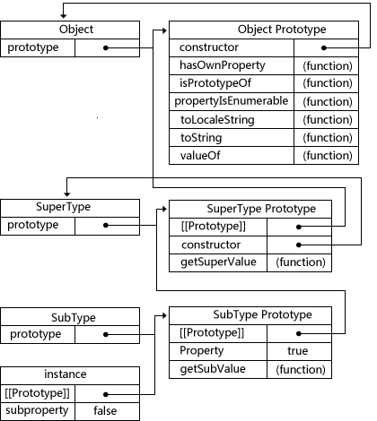

JavaScript继承
=========

###1、原型链
**构造函数、原型、实例之间的关系：**
- *1、每个构造函数都有一个原型对象*
- *2、原型对象都包含一个指向构造函数的指针*
- *3、实例都包含一个指向原型对象的内部指针*

**原型链**————让原型对象等于另一个类型的实例，此时的原型对象包含一个指向另一个原型的指针，相应地，另一个原型中也包含着一个指向另一个构造函数的指针。若另一个原型又是另一个类型的实例，上述关系依然成立，层层递推，就构成了实例与原型的链条。
```javascript
function SuperType() {
    this.property = true;
}

SuperType.prototype.getSuperValue = function() {
    return this.property;
}

function SubType() {
    this.subproperty = false;
}

SubType.prototype = new SuperType();

SubType.prototype.getSubValue = function() {
    return this.subproperty;
}

var instance = new SubType();
alert(instance.getSuperValue()); // true

alert(instance instanceof Object);    // true
alert(instance instanceof SuperType); // true
alert(instance instanceof SubType);   // true

alert(Object.prototype.isPrototypeOf(instance));    // true
alert(SuperType.prototype.isPrototypeOf(instance)); // true
alert(SubType.prototype.isPrototypeOf(instance));   // true
```
**继承的本质就是用一个新类型的实例重写原型对象。**


上述代码，没有使用SubType默认提供的原型，用SuperType的实例给它换了一个新原型。因此，新原型不仅具有作为一个SuperType的实例所拥有的全部属性和方法，而且其内部还有一个指针，指向了SuperType的原型。

最终结果是：
- 1）instance指向SubType原型，SubType原型内部有一个指针，指向SuperType的原型。
- 2）getSuperValue()方法在SuperType.prototype中，但property位于SubType原型中。因为property是一个实例属性，而getSuperValue()是一个原型方法。SubType原型是SuperType的实例，因此property位于SubType原型中。

**【注】**
instance.constructor现在指向的是SuperType，因为SubType的原型指向了另一个对象——SuperType的原型，而这个原型对象的constructor属性指向的是SuperType。

**通过实现原型链，本质上扩展了原型搜索机制。**
- *当以读取模式访问一个实例属性时，首先会在实例中搜索该属性。*
- *如果没有找到该属性，则会继续搜索实例的原型。*
- *在通过原型链实现继承的情况下，搜索过程就得以沿着原型链继续向上。*

调用instance.getSuperValue()会经历三个搜索步骤：

- 1）搜索实例；
- 2）搜索SubType.prototype；
- 3）搜索SuperType.prototype，最后一步才会找到该方法。

在找不到属性或方法的情况下，搜索过程总是要一环一环地前行到原型链末端才会停下来。
####1）别忘记默认的原型
**所有引用类型默认都继承了Object**，而这个继承也是通过原型链实现的。**所有函数的默认原型都是Object的实例**，因此默认原型都会包含一个指针，指向Object.prototype。这也正是所有自定义类型都会继承toString()、ValueOf()等默认方法的根本原因。

完整的原型链如下所示：



SubType继承了SuperType，而SuperType继承了Object。当调用instance.toString()时，实际上调用的是保存在Object.prototype中的那个方法。

####2）确定原型和实例的关系
通过两种方法来确定原型和实例之间的关系：
- 第一种方式是使用**instanceof操作符**
 
**只要用这个操作符来测试实例与原型中出现过的构造函数，结果就会返回true。**
```javascript
alert(instance instanceof Object);     // true
alert(instance instanceof SuperType);  // true
alert(instance instanceof SubType);    // true
```
由于原型链的关系，可以说instance是Object、SuperType或SubType中任何一个类型的实例。因此，测试这三个构造函数的结果都返回了true.
- 第二种方法是使用**isPrototypeOf()方法**

**只要是原型链中出现过的原型，都可以说是该原型链所派生的实例的原型**，因此isPrototypeOf()方法也返回ture。
```javascript
alert(Object.prototype.isPrototypeOf(instance));     // true
alert(SuperType.prototype.isPrototypeOf(instance));  // true
alert(SubType.prototype.isPrototypeOf(instance));    // true
```
####3）谨慎地定义方法
子类型有时候需要重写类型中的某个方法，或者需要添加超类型中不存在的某个方法。但不管怎样，给原型添加方法的代码一定要放在替换原型的语句之后。
```javascript
function SuperType() {
    this.property = true;
}

SuperType.prototype.getSuperValue = function() {
    return this.property;
};

function SubType() {
    this.subproperty = false;
}

// 继承了SuperType()
SubType.prototype = new SuperType();

// 添加了新方法
SubType.prototype.getSubValue = function() {
    return this.subproperty;
};

// 重写超类型中的方法
SubType.prototype.getSuperValue = function() {
    return false;
};

var instance = new SubType();
alert(instance.getSuperValue()); // false
```
当通过SubType的实例调用getSuperValue()时，调用的就是这个重新定义的方法；但通过SuperType的实例调用getSuperValue()时，还会继续调用原来的那个方法。

**【注】**
- *1、必须在用SuperType的实例替换原型之后，再定义这两个方法。*
- *2、在通过原型链实现继承时，不能使用对象字面量创建原型方法。这样会重写原型链。*

```javascript
function SuperType() {
    this.property = true;
}

SuperType.prototype.getSuperValue = function() {
    return this.property;
};

function SubType() {
    this.subproperty = false;
}

// 继承了SuperType
SubType.prototype = new SuperType();

// 使用字面量添加新方法，会导致上一行代码无效
SubType.prototype = {
    getSubValue: function() {
        return this.subproperty;
    },
    someOtherMethod: function() {
        return false;
    }
};

var instance = new SubType();
alert(instance.getSuperValue()); // error!
```
把SuperType的实例赋值给原型，又将原型替换成一个对象字面量，由于替换后的原型包含的是一个Object的实例，而非SuperType的实例，因此原型链被切断——SubType和SuperType之间已经没有关系了。
####4）原型链的问题
**原型链的问题：**
- 最主要的问题来自*包含引用类型值的原型。*

包含引用类型值的原型属性会被所有实例共享，所以一般在构造函数中定义属性，在原型对象中定义方法。通过原型来实现继承时，原型会变成另一个类型的实例。于是，另一类型的实例属性也就顺理成章地变成了原型属性。
```javascript
function SuperType() {
    this.colors = ["red", "blue", "green"];
}

function SubType() {
}

// 继承了SuperType
SubType.prototype = new SuperType();

var instancel = new SubType();
instancel.colors.push("black");
alert(instancel.colors); // "red,blue,green,black"

var instance2 = new SubType();
alert(instance2.colors); // "red,blue,green,black"
```
SuperType构造函数定义了一个colors属性，该属性包含一个数组(引用类型值)。SuperType的每个实例都会有各自包含自己数组的colors属性。当SubType通过原型链继承了SuperType之后，SubType.prototype就变成了SuperType的一个实例，SubType.prototype拥有了colors属性，SubType的所有实例都会共享这个colors属性。

- 原型链的第二个问题是：*在创建子类型的实例时，不能向超类型的构造函数中传递参数。*

**【注】**
实际上，没有办法在不影响所有对象实例的情况下，给超类型的构造函数传递参数。有鉴于此，再加上前面刚刚讨论过的由于原型中包含引用类型值所带来的问题，实践中很少会单独使用原型链。


###2、借用构造函数

**借用构造函数**：在子构造函数的内部调用超类型构造函数。解决了原型中包含引用类型值所带来的问题。

**函数是在特定环境中执行代码的对象，通过使用apply()和call()方法可以在新创建的对象上执行构造函数。**
```javascript
function SuperType() {
    this.colors = ["red", "blue", "green"];
}

function SubType() {
    // 继承了SuperType
    SuperType.call(this);
}

var instance1 = new SubType();
instance1.colors.push("black");
alert(instance1.colors);  // "red,blue,green,black"

var instance2 = new SubType();
alert(instance2.colors);  // "red,blue,green"
```
通过使用call()方法“借调”了超类型的构造函数，在新创建的SubType实例的环境下调用了SuperType构造函数，在新SubType对象上执行SuperType()函数中定义的所有对象初始化代码，SubType的每个实例都会具有自己的colors属性的副本。
####1）传递参数
相对于原型链而言，借用构造函数有一个很大的优势，即可以在子类型构造函数中向超类型构造函数传递参数。
```javascript
function SuperType(name) {
    this.name = name;
}

function SubType() {
    SuperType.call(this, "Nicholas");
    this.age = 29;
}

var instance = new SubType();
alert(instance.name); // "Nicholas";
alert(instance.age);  // 29
```
在SubType构造函数内部调用SuperType构造函数时，实际上是为SubType的实例设置了name属性。为了确保SuperType构造函数不会重写子类型的属性，可以在调用超类型构造函数后，再添加应该在子类型中定义的属性。

####2）借用构造函数的问题
- *1、无法避免构造函数模式存在的问题——方法都在构造函数中定义，函数无法复用。*
- *2、超类型原型中定义的方法，对子类型是不可见的，所有类型只能使用构造函数模式。*
- *3、构造函数很少单独使用。*

###3、组合继承

**组合继承（伪经典继承）**：将原型链和借用构造函数的技术组合到一块，从而发挥二者之长的一种继承模式。

**设计思路：**
- 1、使用原型链实现对原型属性和方法的继承。
- 2、通过借用构造函数来实现对实例属性的继承。

这样，通过在原型上定义方法实现了函数复用，又能够保证每个实例都有自己的属性。
```javascript
function SuperType(name) {
    this.name = name;
    this.colors = ["red", "blue", "green"];
}

SuperType.prototype.sayName = function() {
    alert(this.name);
};

function SubType(name, age) {
    // 继承属性
    SuperType.call(this, name);
    this.age = age;
}

// 继承方法
SubType.prototype = new SuperType();
SubType.prototype.sayAge = function() {
    alert(this.age);
};

var instance1 = new SubType("Nicholas", 29);
instance1.colors.push("break");
alert(instance1.colors);  // "red,blue,green,black"
instance1.sayName();      // "Nicholas"
instance1.sayAge();       // 29

var instance2 = new SubType("Greg", 27);
alert(instance2.colors);  // "red,blue,green"
instance2.sayName();      // "Greg"
instance2.sayAge();       // 27
```
**优点**：
- *1、避免了原型链和借用构造函数的缺陷，融合了它们的优点，成为JavaScript中最常见的继承模式。*
- *2、instanceof 和 isPrototypeOf() 也能够用于识别基于组合继承创建的对象。*

###4、原型式继承

**原型式继承**：借助原型可以基于已有对象创建新对象，同时还不必因此创建自定义类型。
```javascript
function object(o) {
    function F() {}
    F.prototype = o;
    return new F();
}
```
在object()函数内部，先创建了一个临时性的构造函数，然后将传入的对象作为这个构造函数的原型，最后返回了这个临时类型的一个新实例。从本质上来讲，object()对传入其中的对象执行了一次浅复制。
```javascript
var person = {
    name: "Nicholas",
    friends: ["Shelby", "Court", "Van"]
};

var anotherPerson = object(person);
anotherPerson.name = "Greg";
anotherPerson.friends.push("Rob");

var yetAnotherPerson = object(person);
yetAnotherPerson.name = "Linda";
yetAnotherPerson.friends.push("Barbie");

alert(person.friends);  // "Shelby,Court,Van,Rob,Barbie"
```
这种原型式继承，要求必须有一个对象可以作为另一个对象的基础。如果有这么一个对象的话，可以把它传递给object()函数，然后在根据具体需求对得到的对象加以修改即可。

将person对象作为另一个对象的基础，传入到object()函数中得到一个新对象。新对象将person作为原型，因此它的原型中包含一个基本类型值属性name和一个引用类型值属性friends。person对象的friends属性不仅属于person所有，也被anotherPerson和yetAnotherPerson共享。

**实际上，相当于创建了person对象的两个副本。**

ECMAScript 5通过新增**Object.create()方法**规范化了**原型式继承**。

**Object.create()方法**接收两个参数：
- 一个用作新对象原型的对象。
- 一个为新对象定义额外属性的对象（可选的）。
- 在传入一个参数的情况下，Object.create()与object()方法行为相同。

```javascript
var person = {
    name: "Nicholas",
    friends: ["Shelby", "Court", "Van"]
};

var anotherPerson = Object.create(person);
anotherPerson.name = "Greg";
anotherPerson.friends.push("Rob");

var yetAnotherPerson = Object.create(person);
yetAnotherPerson.name = "Linda";
yetAnotherPerson.friends.push("Barbie");

alert(person.friends); // "Shelby,Court,Van,Rob,Barbie"
```
Object.create()方法的第二个参数与Object.defineProperties()方法的第二个参数相同：每个属性都是通过自己的描述符定义的。以这种方式指定的任何属性都会覆盖原型对象上的同名属性。

**不想创建构造函数，又想让一个对象与另一个对象保持类似，通常采用原型式继承。**

**【注】**
原型式继承包含引用类型值的属性始终都会共享相应的值，就像使用原型模式一样。

###5、寄生式继承

**寄生式继承**的思路与寄生构造函数和工厂模式类似，即创建一个仅用于封装继承过程的函数，该函数在内部以某种方式来增强对象，最后再像它真的是做了所有工作一样返回对象。
```javascript
function object(o) {
    function F() {}
    F.prototype = o;
    return new F();
}

function createAnother(original) {
    var clone = object(original);
    clone.sayHi = function() {
        alert("hi");
    };
    return clone;
}
```
createAnother()函数接收一个对象，并将该对象传递给object()函数，返回的结果赋值给clone，再为clone对象添加一个新方法sayHi()，最后返回clone对象。
```javascript
var person = {
    name: "Nicholas",
    friends: ["Shelby", "Court", "Van"]
};

var anotherPerson = createAnother(person);
anotherPerson.sayHi(); // "hi"
```
基于person返回了一个新对象——anotherPerson，新对象不仅具有person的所有属性和方法，而且还有自己的sayHi()方法。

**【注】**
- 1、操作的是对象，不是自定义类型和构造函数，寄生式继承是一种有用的模式。
- 2、继承模式不必须使用object()函数。
- 3、任何能够返回新对象的函数都适用于此模式。
- 4、使用寄生式继承来为对象添加函数，会由于不能做到函数复用而降低效率，这一点与构造函数模式类似。

###6、寄生组合式继承
**组合继承的缺点**：无论什么情况下，都会调用两次超类型构造函数。
- 一次是创建子类型原型的时候。
- 一次是子类型构造函数内部。

```javascript
function SuperType(name) {
    this.name = name;
    this.colors = ["red", "blue", "green"];
}

SuperType.prototype.sayName = function () {
    alert(this.name);
};

function SubType(name, age) {
    SuperType.call(this, name);       // 第二次调用SuperType()
    this.age = age;
}

SubType.prototype = new SuperType();  // 第一次调用SuperType()
SubType.prototype.construcotr = SubType;
SubType.prototype.sayAge = function() {
    alert(this.age);
}

var instance1 = new SubType("Nicholas", 29);
instance1.colors.push("black");
alert(instance1.colors);  // "red,blue,green,black"
instance1.sayName();      // "Nicholas"
instance1.sayAge();       // 29

var instance2 = new SubType("Greg", 27);
alert(instance2.colors);  // "red,blue,green"
instance2.sayName();      // "Greg"
instance2.sayAge();       // 27
```
第一次调用SuperType构造函数时，SubType.prototype会得到两个属性：name和colors，它们都是SuperType的实例属性。当调用SubType构造函数时，又会调用一次SuperType构造函数，这一次又在新对象上创建了实例属性name和colors。于是，这两个属性就屏蔽了原型中的两个同名属性。

**寄生式组合继承**：通过借用构造函数来继承属性，通过原型链的混成形式来继承方法。

**基本思路**：不必为了指定子类型的原型而调用超类型的构造函数，我们所需要的无非就是超类型原型的一个副本而已。本质上，使用寄生式继承来继承超类型的原型，然后再将结果指定给子类型的原型。

**寄生组合式继承的基本模式**：
```javascript
function object(o) {
    function F() {}
    F.prototype = o;
    return new F();
}

function inheritPrototype(subType, superType) {
    var prototype = object(superType.prototype);  // 创建对象
    prototype.constructor = subType;              // 增强对象
    subType.prototype = prototype;                // 指定对象
}
```
inheritPrototype()函数实现了寄生组合式继承的最简单形式。

inheritPrototype()函数接收两个参数：子类型构造函数和超类型构造函数。
- 在函数内部，第一步是创建超类型原型的一个副本。
- 第二步是为创建的副本添加constructor属性，从而弥补因重写原型而失去的默认的constructor属性。
- 最后一步，将新创建的对象赋值给子类型的原型。

```javascript
function SuperType(name) {
    this.name = name;
    this.colors = ["red", "blue", "green"];
}
SuperType.prototype.sayName = function() {
    alert(this.name);
};

function SubType(name, age) {
    SuperType.call(this, name);
    this.age = age;
}

inheritPrototype(SubType, SuperType);

SubType.prototype.sayAge = function() {
    alert(this.age);
}

var instance1 = new SubType("Nicholas", 29);
instance1.colors.push("black");
alert(instance1.colors);  // "red,blue,green,black"
instance1.sayName();      // "Nicholas"
instance1.sayAge();       // 29

var instance2 = new SubType("Greg", 27);
alert(instance2.colors);  // "red,blue,green"
instance2.sayName();      // "Greg"
instance2.sayAge();       // 27
```
**寄生组合继承的优点**：
- *1、只调用了一次SuperType构造函数，避免了在SubType.prototype上面创建不必要的、多余的属性。*
- *2、原型链保持不变，能够正常使用instanceof和isPrototypeOf()。*
- *3、开发人员普遍认为寄生组合式继承是引用类型最理想的继承模式。*

**【拓展】**

YUI的YAHOO.lang.extend()方法采用了寄生组合继承，从而让这种模式首次出现在了一个应用非常广泛的javaScript库中。