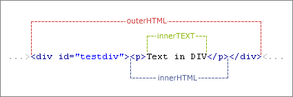

JavaScript DOM 扩展
=========

###1、呈现模式

随着**IE**开始区分**标准模式**和**混杂模式**，确定浏览器处于何种模式的需求也就应运而生。IE为document对象添加了一个名为**compatMode属**性，这个属性的唯一使命就是**表示浏览器处于什么模式**。
- 如果是**标准模式**，则**document.compatMode**的值等于“**CSS1Compat**”。
- 如果是**混杂模式**，则**document.compatMode**的值等于“**BackCompat**”。

```javascript
if (document.compatMode == "CSS1Compat") {  
    alert("Standards mode");  
} else {  
    alert("Quirks mode");  
}
```

**Firefox**、**Opera**、**Chrome**、**Safari（3.1版开始）**都实现了**document.compatMode**。

**IE8**又为document对象引入了一个名为**documentMode**的新属性，IE8有3中不同的呈现模式，这个属性正是为了区分这些模式。
- 属性的值如果是**5**，则表示**混杂模式**（即IE5模式）。
- 属性的值如果是**7**，则表示**IE7仿真模式**。
- 属性的值如果是**8**，则表示**IE8标准模式**。
      
```javascript  
if (document.documentMode > 7) {  
    alert("IE 8+ Standards Mode");  
}
```

**【注】**
- documentMode取得的值是真正的IE按照那种模式去解析页面。
- `$.browser.version`所取得的IE版本是不准确的【嵌套iframe的时候】，特别是外部嵌套webbrowser的时候。

不管是IE8还是IE9，用webbrowser嵌套后用`$.browser.version`取到的IE版本总是7.0，如果增加了`<meta http-equiv="x-ua-compatible" content="IE=5;IE=8;" />`这个标记，取到的结果依然是7.0，但是实际上取到的documentMode为8，而页面也是按照IE=8的模式去解析的。

通过`$.browser.version`取到的版本不是真正页面按照那个IE版本去解析的，而documentMode取得的结果却是IE按照哪个模式进行解析的，documentMode是IE8之后新增的。

###2、常见操作
- **innerHTML**：设置或获取位于对象起始和结束标签内的 HTML。
- **outerHTML**：设置或获取对象及其内容的 HTML 形式。
- **innerText**：设置或获取位于对象起始和结束标签内的文本。
- **outerText**：设置(包括标签)或获取(不包括标签)对象的文本。

**innerText**和**outerText**在获取时是相同效果，但在设置时，**innerText**仅设置**标签内的文本**，而**outerText**设置包括**标签在内的文本**。

```html
<!DOCTYPE html PUBLIC "-//W3C//DTD HTML 4.01 Transitional//EN" "http://www.w3.org/TR/html4/loose.dtd">  
<html>  
<head>  
  <meta http-equiv="Content-Type" content="text/html; charset=UTF-8">  
  <title>innerHTML、outerHTML和innerText、outerHTML的区别</title>  
  <script language="JavaScript" type="text/javascript">   
    //.innerHTML  
    function innerHTMLDemo() {   
        test_id1.innerHTML = "<i><u>设置或获取位于对象起始和结束标签内的 HTML.</u></i>";   
    }   
    
    //.innerText  
    function innerTextDemo() {   
        test_id2.innerText = "<i><u>设置或获取位于对象起始和结束标签内的文本.</u></i>";   
    }   
    
    //.outerHTML  
    function outerHTMLDemo() {   
        test_id3.outerHTML = "<font size=9pt color=red><i><u>设置或获取对象及其内容的 HTML 形式.</u></i></font>";   
    }  
    
    //.outerText  
    function outerTextDemo() {   
        test_id4.outerText = "<br></br><i><u>设置(包括标签)或获取(不包括标签)对象的文本.</u></i>";   
    }  
  </script>   
</head>   
<body>   
  <ul>   
　　<li id="test_id1" onclick="innerHTMLDemo()">innerHTML效果.</li>   
　　<li id="test_id2" onclick="innerTextDemo()">innerText效果.</li>   
　　<li id="test_id3" onclick="outerHTMLDemo()">outerHTML效果.</li>   
　　<li id="test_id4" onclick="outerTextDemo()">outerText效果.</li>   
  </ul>   
</body>   
</html>  
```

**innerHTML**、**outerHTML**、**innerText**、 **outerText**区别：
- 1）innerHTML与outerHTML在设置对象的内容时包含的HTML会被解析，而innerText与outerText则不会。 
- 2）在设置时，innerHTML与innerText仅设置标签内的文本，而outerHTML与outerText设置包括标签在内的文本。 
    
对于一个id为"testdiv"的div来说，outerHTML、innerHTML以及innerTEXT三者的区别可以通过下图展示出来： 


