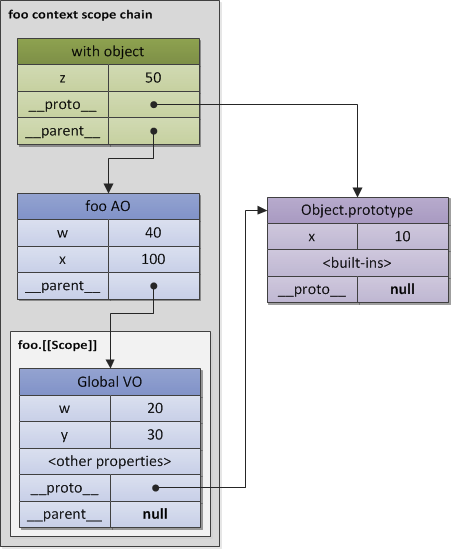

JavaScript 核心
=========

###1、对象Object

ECMAScript是一门高度抽象的面向对象(object-oriented)语言，用以处理Objects对象. 当然，也有基本类型，但是必要时，也需要转换成object对象来用。

> An object is a collection of properties and has a single prototype object. The prototype may be either an object or the null value.

**Object是一个属性的集合，并且都拥有一个单独的原型对象[prototype object]**. 这个原型对象[prototype object]可以是一个object或者null值。

让我们来举一个基本Object的例子，首先我们要清楚，**一个Object的prototype是一个内部的[[prototype]]属性的引用**。

不过一般来说，我们会使用`__<内部属性名>__ `**下划线来代替双括号**，例如`__proto__`(这是某些脚本引擎比如SpiderMonkey的对于原型概念的具体实现，尽管并非标准)。
```javascript
var foo = {
  x: 10,
  y: 20
};
```
上述代码foo对象有两个显式的属性[explicit own properties]和一个**自带隐式的** `__proto__` **属性** `[implicit __proto__ property]`，指向foo的原型。


为什么需要原型呢，让我们考虑 **原型链** 的概念来回答这个问题。

###2、原型链（Prototype chain）

原型对象也是普通的对象，并且也有可能有自己的原型，如果**一个原型对象的原型不为null**的话，我们就称之为**原型链**（prototype chain）。

> A prototype chain is a finite chain of objects which is used to implemented inheritance and shared properties.

**原型链**是一个由对象组成的有限对象链由于实现继承和共享属性。

想象一个这种情况，2个对象，大部分内容都一样，只有一小部分不一样，很明显，在一个好的设计模式中，我们会需要重用那部分相同的，而不是在每个对象中重复定义那些相同的方法或者属性。在基于类[class-based]的系统中，这些重用部分被称为类的继承 – 相同的部分放入class A，然后class B和class C从A继承，并且可以声明拥有各自的独特的东西。

**ECMAScript没有类的概念**。但是，重用[reuse]这个理念没什么不同（某些方面，甚至比class-更加灵活），可以由prototype chain原型链来实现。这种继承被称为delegation based inheritance-基于继承的委托，或者更通俗一些，叫做**原型继承**。

类似于类”A”，”B”，”C”，在ECMAScript中尼创建对象类”a”，”b”，”c”，相应地， 对象“a” 拥有对象“b”和”c”的共同部分。同时对象“b”和”c”只包含它们自己的附加属性或方法。
```javascript
var a = {
  x: 10,
  calculate: function (z) {
    return this.x + this.y + z
  }
};
 
var b = {
  y: 20,
  __proto__: a
};
 
var c = {
  y: 30,
  __proto__: a
};
 
// 调用继承过来的方法
b.calculate(30); // 60
c.calculate(40); // 80
```
这样看上去是不是很简单啦。b和c可以使用a中定义的calculate方法，这就是有原型链来[prototype chain]实现的。

> **原型链**的**原理**：如果在对象b中找不到calculate方法(也就是对象b中没有这个calculate属性)，那么就会沿着原型链开始找。如果这个calculate方法在b的prototype中没有找到，那么就会沿着原型链找到a的prototype，一直遍历完整个原型链。记住，一旦找到，就返回第一个找到的属性或者方法。因此，第一个找到的属性成为继承属性。如果遍历完整个原型链，仍然没有找到，那么就会返回undefined。

**【注】** **this**这个值在一个继承机制中，仍然是**指向它原本属于的对象**，而不是从原型链上找到它时，它所属于的对象。

例如，以上的例子，this.y是从b和c中获取的，而不是a。当然，你也发现了this.x是从a取的，因为是通过原型链机制找到的。

如果一个**对象的prototype没有显示的声明过或定义过**，那么**`__prototype__`的默认值就是object.prototype**， 而**object.prototype也会有一个**`__prototype__`，这个就是原型链的终点了，被设置为null。

下面的图示就是表示了上述a,b,c的继承关系


**原型链**的**使用场景**：
- **对象**拥有 **相同或相似的状态结构**(same or similar state structure) （即相同的属性集合）与 **不同的状态值**(different state values)。在这种情况下，我们可以使用 构造函数(Constructor) 在 特定模式(specified pattern) 下创建对象。

###3、构造函数(Constructor)

除了创建对象，**构造函数**(constructor) 还做了另一件有用的事情——**自动为创建的新对象设置了原型对象**(prototype object) 。**原型对象存放于 ConstructorFunction.prototype 属性中**。

例如，我们重写之前例子，使用构造函数创建对象“b”和“c”，那么对象”a”则扮演了“Foo.prototype”这个角色：
```javascript
// 构造函数
function Foo(y) {
  // 构造函数将会以特定模式创建对象：被创建的对象都会有"y"属性
  this.y = y;
}
 
// "Foo.prototype"存放了新建对象的原型引用
// 所以我们可以将之用于定义继承和共享属性或方法
// 所以，和上例一样，我们有了如下代码：
 
// 继承属性"x"
Foo.prototype.x = 10;
 
// 继承方法"calculate"
Foo.prototype.calculate = function (z) {
  return this.x + this.y + z;
};
 
// 使用foo模式创建 "b" and "c"
var b = new Foo(20);
var c = new Foo(30);
 
// 调用继承的方法
b.calculate(30); // 60
c.calculate(40); // 80
 
// 让我们看看是否使用了预期的属性
 
console.log(
 
  b.__proto__ === Foo.prototype, // true
  c.__proto__ === Foo.prototype, // true
 
  // "Foo.prototype"自动创建了一个特殊的属性"constructor"
  // 指向a的构造函数本身
  // 实例"b"和"c"可以通过授权找到它并用以检测自己的构造函数
 
  b.constructor === Foo, // true
  c.constructor === Foo, // true
  Foo.prototype.constructor === Foo // true
 
  b.calculate === b.__proto__.calculate, // true
  b.__proto__.calculate === Foo.prototype.calculate // true
 
);
```
上述代码可表示为如下的关系：


上述图示可以看出，每一个object都有一个prototype. 构造函数Foo也拥有自己的`__proto__`, 也就是Function.prototype, 而Function.prototype的`__proto__`指向了Object.prototype. 重申一遍，Foo.prototype只是一个显式的属性，也就是b和c的`__proto__`属性。

###4、执行上下文栈(Execution Context Stack)

在ECMASscript中的**代码有三种类型**：**global**, **function**和**eval**。

每一种代码的执行都需要依赖自身的上下文。
- **global**的上下文可能涵盖了很多的function和eval的实例。
- **函数**的每一次调用，都会进入函数执行中的上下文，并且来计算函数中变量等的值。
- **eval**函数的每一次执行，也会进入eval执行中的上下文，判断应该从何处获取变量的值。

**【注】**  一个function可能产生无限的上下文环境，因为一个函数的调用（甚至递归）都产生了一个新的上下文环境。

```javascript
function foo(bar) {}

// 调用相同的function，每次都会产生3个不同的上下文
//（包含不同的状态，例如参数bar的值）

foo(10);
foo(20);
foo(30);
```
**一个执行上下文可以激活另一个上下文**，就好比一个函数调用了另一个函数(或者全局的上下文调用了一个全局函数)，然后一层一层调用下去。逻辑上来说，这种实现方式是**栈**，我们可以称之为**上下文堆栈**。
- **激活其它上下文的某个上下文**被称为 **调用者**(caller)。
- **被激活的上下文**被称为 **被调用者**(callee)。
- **被调用者同时也可能是调用者**(比如一个在全局上下文中被调用的函数调用某些自身的内部方法)。

> 当一个caller激活了一个callee，那么这个caller就会暂停它自身的执行，然后将控制权交给这个callee。于是这个callee被放入堆栈，称为**进行中的上下文**[running/active execution context]。当这个callee的上下文结束之后，会把控制权再次交给它的caller，然后caller会在刚才暂停的地方继续执行。在这个caller结束之后，会继续触发其他的上下文。一个callee可以用返回（return）或者抛出异常（exception）来结束自身的上下文。

**所有的ECMAScript的程序执行都可以看做是一个执行上下文堆栈**[execution context (EC) stack]。**堆栈的顶部**就是处于**激活状态的上下文**。


> 当一段**程序开始**时，会**先进入全局执行上下文环境**[global execution context], 这个也是堆栈中最底部的元素。此全局程序会开始初始化，**初始化生成必要的对象**[objects]**和函数**[functions]。在此**全局上下文执行的过程中**，它可能会激活一些方法（当然是已经初始化过的），然后进入他们的上下文环境，然后将新的元素压入堆栈。在这些初始化都结束之后，这个系统会等待一些事件（例如用户的鼠标点击等），会触发一些方法，然后进入一个新的上下文环境。

有一个函数上下文“EC1″和一个全局上下文“Global EC”，下图展现了从“Global EC”进入和退出“EC1″时栈的变化:


**栈中每一个执行上下文**可以表示为一个**对象**。让我们看看上下文对象的结构以及执行其代码所需的 **状态**(state) 。

###5、执行上下文(Execution Context)

一个执行的上下文可以抽象的理解为object。**每一个执行的上下文**都有**一系列的属性**（我们称为**上下文状态**），他们用来追踪关联代码的执行进度。这个图示就是一个context的结构。


除了这**3个所需要的属性**(**变量对象**(variable object)，**this指针**(this value)，**作用域链**(scope chain))，执行上下文根据具体实现还可以具有任意额外属性。

###6、变量对象(Variable Object)
> A variable object is a scope of data related with the execution context. 
It’s a special object associated with the context and which stores variables and function declarations are being defined within the context.

**变量对象**(variable object) 是与执行上下文相关的 **数据作用域**(scope of data) 。
它是与上下文关联的特殊对象，用于**存储**被定义在上下文中的 **变量**(variables) 和 **函数声明**(function declarations) 。

**【注】**  **函数表达式**[function expression]（而不是函数声明[function declarations]）是**不包含在VO**[variable object]**里面**的。

**变量对象**（Variable Object）是一个抽象的概念，不同的上下文中，它表示使用不同的object。

例如，在global全局上下文中，变量对象也是全局对象自身[global object]。（这就是我们可以通过全局对象的属性来指向全局变量）。

让我们看看下面例子中的全局执行上下文情况：
```javascript
var foo = 10;

function bar() {} // // 函数声明
(function baz() {}); // 函数表达式

console.log(
  this.foo == foo, // true
  window.bar == bar // true
);

console.log(baz); // 引用错误，baz没有被定义
```
全局上下文中的变量对象(VO)会有如下属性：


如上所示，函数“baz”如果作为函数表达式则不被不被包含于变量对象。这就是在函数外部尝试访问产生引用错误(ReferenceError)的原因。

**【注】**  
- **ECMAScript**和其他语言相比(比如C/C++)，**仅有函数能够创建新的作用域**。在函数内部定义的变量与内部函数，在外部非直接可见并且不污染全局对象。
- 使用 eval 的时候，同样会使用一个新的(eval创建)执行上下文。eval会使用全局变量对象或调用者的变量对象(eval的调用来源)。

在一个**函数上下文中**，**变量对象被表示为活动对象**(activation object)。

###7、活动对象(activation object)

当**函数被调用者激活**，这个特殊的**活动对象**(activation object) 就**被创建**了。它包含**普通参数**(formal parameters)与**特殊参数**(arguments)对象（具有索引属性的参数映射表）。**活动对象在函数上下文中作为变量对象使用**。

即：函数的变量对象保持不变，但除去存储变量与函数声明之外，还包含以及特殊对象arguments 。

考虑下面的情况：
```javascript
function foo(x, y) {
  var z = 30;
  function bar() {} // 函数声明
  (function baz() {}); // 函数表达式
}

foo(10, 20);
```
“foo”函数上下文的下一个激活对象(AO)如下图所示：


同样道理，函数表达式(function expression)不在AO的行列。

###8、作用域链(Scope Chains)

> A scope chain is a list of objects that are searched for identifiers appear in the code of the context.

**作用域链**是一个 **对象列表**(list of objects) ，用以**检索**上下文代码中出现的 **标识符**(identifiers) 。

**作用域链的原理和原型链很类似**，如果这个变量在自己的作用域中没有，那么它会寻找父级的，直到最顶层。

**标示符**[Identifiers]可以理解为**变量名称**、**函数声明**和**普通参数**。例如，当一个函数在自身函数体内需要引用一个变量，但是这个变量并没有在函数内部声明（或者也不是某个参数名），那么这个变量就可以称为自由变量[free variable]。那么我们搜寻这些自由变量就需要用到作用域链。

- 在**一般情况**下，**一个作用域链**包括**父级变量对象**（variable object）（作用域链的顶部）、**函数自身变量VO**和**活动对象**（activation object）。

- 有些情况下也会包含其它的对象，例如在执行期间，动态加入作用域链中的——例如with或者catch语句。
    - with-objects指的是**with语句**，产生的临时作用域对象；
    - catch-clauses指的是**catch从句**，如catch(e)，这会产生异常对象，导致作用域变更]。

当查找标识符的时候，会从作用域链的活动对象部分开始查找，然后(如果标识符没有在活动对象中找到)查找作用域链的顶部，循环往复，就像作用域链那样。
```javascript
var x = 10;
 
(function foo() {
  var y = 20;
  (function bar() {
    var z = 30;
    // "x"和"y"是自由变量
    // 会在作用域链的下一个对象中找到（函数”bar”的互动对象之后）
    console.log(x + y + z);
  })();
})();
```
我们假设作用域链的对象联动是通过一个叫做`__parent__`的属性，它是指向作用域链的下一个对象。这可以在Rhino Code中测试一下这种流程，这种技术也确实在ES5环境中实现了(有一个称为outer链接).当然也可以用一个简单的数据来模拟这个模型。使用`__parent__`的概念，我们可以把上面的代码演示成如下的情况。（因此，父级变量是被存在函数的[[Scope]]属性中的）。


在**代码执行过程中**，如果**使用with或者catch语句**就会**改变作用域链**。而这些对象都是一些简单对象，他们也会有原型链。这样的话，作用域链会从两个维度来搜寻。
- 首先在原本的作用域链.
- 每一个链接点的作用域的链（如果这个链接点是有prototype的话）.

我们再看下面这个例子：
```javascript
Object.prototype.x = 10;
 
var w = 20;
var y = 30;
 
// 在SpiderMonkey全局对象里
// 例如，全局上下文的变量对象是从"Object.prototype"继承到的
// 所以我们可以得到“没有声明的全局变量”
// 因为可以从原型链中获取
 
console.log(x); // 10
 
(function foo() {
 
  // "foo" 是局部变量
  var w = 40;
  var x = 100;
 
  // "x" 可以从"Object.prototype"得到，注意值是10哦
  // 因为{z: 50}是从它那里继承的
 
  with ({z: 50}) {
    console.log(w, x, y , z); // 40, 10, 30, 50
  }
 
  // 在"with"对象从作用域链删除之后
  // x又可以从foo的上下文中得到了，注意这次值又回到了100哦
  // "w" 也是局部变量
  console.log(x, w); // 100, 40
 
  // 在浏览器里
  // 我们可以通过如下语句来得到全局的w值
  console.log(window.w); // 20
 
})();
```
我们就会有如下结构图示。这表示，在我们去搜寻`__parent__`之前，首先会去`__proto__`的链接中。



**【注】**  **不是所有的全局对象都是由Object.prototype继承而来的。**

- 只要所有外部函数的变量对象都存在，那么从内部函数引用外部数据则没有特别之处。只要遍历作用域链表，查找所需变量。
- 然而，当一个上下文终止之后，其状态与自身将会被 销毁(destroyed)，同时内部函数将会从外部函数中返回。
- 此外，这个返回的函数之后可能会在其他的上下文中被激活。

**【问】** 如果一个之前被终止的含有一些自由变量的上下文又被激活将会怎样？
**【答】** 通常来说，解决这个问题的概念在ECMAScript中与作用域链直接相关，被称为 (词法)**闭包**((lexical) closure)。

###9、闭包(Closures)

> 在ECMAScript中，**函数**是“第一类”**对象**。这个名词意味着**函数可以作为参数被传递给其他函数使用** (在这种情况下，**函数被称为“funargs”**——“functional arguments”的缩写[译注：这里不知翻译为泛函参数是否恰当])。**接收“funargs”的函数**被称之为 **高阶函数**(higher-order functions) ，或者更接近数学概念的话，被称为 **运算符**(operators) 。**其他函数的**运行时也会**返回函数**，这些返回的函数被称为 **function valued 函数** (有 functional value 的函数)。

**“funargs”与“functional values”**有两个概念上的问题，这**两个子问题**被称为“**Funarg problem**” (“**泛函参数问题**”)。要准确解决泛函参数问题，需要引入 **闭包**(closures)的概念。（在ECMAScript中使用了函数的[[Scope]]属性来解决这个问题）。

- “funarg problem”的一个子问题是：**“upward funarg problem”（向上查找的函数参数问题）**
    - 当一个函数从其他函数返回到外部的时候，这个问题将会出现。要能够在外部上下文结束时，进入外部上下文的变量，内部函数 在创建的时候(at creation moment) 需要将之存储进[[Scope]]属性的父元素的作用域中。然后当函数被激活时，上下文的作用域链表现为激活对象与[[Scope]]属性的组合(事实上，可以在上图见到)：

```
Scope chain = Activation object + [[Scope]]
```
```
作用域链 = 活动对象 + [[Scope]]
```
**【注】** 最主要的事情是**函数在被创建时保存外部作用域**，是因为这个被保存的作用域链(saved scope chain) 将会在未来的函数调用中用于变量查找。
```javascript
function foo() {
  var x = 10;
  return function bar() {
    console.log(x);
  };
}
 
// "foo"返回的也是一个function
// 并且这个返回的function可以随意使用内部的变量x
 
var returnedFunction = foo();
 
// 全局变量 "x"
var x = 20;
 
// 支持返回的function
returnedFunction(); // 结果是10而不是20
```
这种形式的作用域称为**静态作用域**[static/lexical scope]。上面的x变量就是在函数bar的[[Scope]]中搜寻到的。**理论上**来说，也会有**动态作用域**[dynamic scope]，也就是上述的x被解释为20，而不是10. 但是**EMCAScript不使用动态作用域**。

- “funarg problem”的另一个类型就是：**”downward funarg problem”（自上而下）**。
    - 在这种情况下，父级的上下会存在，但是在判断一个变量值的时候会有多义性。也就是，这个变量究竟应该使用哪个作用域。是在函数创建时的作用域呢，还是在执行时的作用域呢？为了避免这种多义性，可以**采用闭包**，也就是**使用静态作用域**。

请看下面的例子：
```javascript
// 全局变量 "x"
var x = 10;
 
// 全局function
function foo() {
  console.log(x);
}
 
(function (funArg) {
 
  // 局部变量 "x"
  var x = 20;
 
  // 这不会有歧义
  // 因为我们使用"foo"函数的[[Scope]]里保存的全局变量"x",
  // 并不是caller作用域的"x"
 
  funArg(); // 10, 而不是20
 
})(foo); // 将foo作为一个"funarg"传递下去
```
从上述的情况，我们似乎可以断定，在语言中，**使用静态作用域是闭包的一个强制性要求**。
- 在某些语言中，会提供动态和静态作用域的结合，可以允许开发员选择哪一种作用域。
- **在ECMAScript中，只采用了静态作用域**。所以**ECMAScript完全支持使用[[Scope]]的属性**。我们可以给闭包得出如下定义：

> A closure is a combination of a code block (in ECMAScript this is a function) and statically/lexically saved all parent scopes.
> Thus, via these saved scopes a function may easily refer free variables.

**闭包**是一系列**代码块**（**在ECMAScript中是函数**），并且**静态保存所有父级的作用域**。通过这些保存的作用域来搜寻到函数中的自由变量。

**【注】**  

- 因为每一个普通函数在创建时保存了[[Scope]]，**理论上，ECMAScript中所有函数都是闭包**。

- 还有一个很重要的点，**几个函数可能含有相同的父级作用域**（这是一个很普遍的情况，例如有好几个内部或者全局的函数）。**在这种情况下，在[[Scope]]中存在的变量是会共享的**。**一个闭包中变量的变化，也会影响另一个闭包的**。

```javascript
function baz() {
  var x = 1;
  return {
    foo: function foo() { return ++x; },
    bar: function bar() { return --x; }
  };
}
 
var closures = baz();
 
console.log(
  closures.foo(), // 2
  closures.bar()  // 1
);
```
上述代码可以用这张图来表示：


在某个循环中创建多个函数时，上图会引发一个困惑。如果在创建的函数中使用循环变量(如”k”)，那么所有的函数都使用同样的循环变量，导致一些程序员经常会得不到预期值。现在清楚为什么会产生如此问题了——因为所有函数共享同一个[[Scope]]，其中循环变量为最后一次复赋值。

```javascript
var data = [];
 
for (var k = 0; k < 3; k++) {
  data[k] = function () {
    alert(k);
  };
}
 
data[0](); // 3, but not 0
data[1](); // 3, but not 1
data[2](); // 3, but not 2
```
解决**所有函数共享一个[[Scope]]**带来的问题：
- 其中一种技巧是**在作用域链中提供一个额外的对象**，比如增加一个函数：

```javascript
var data = [];
 
for (var k = 0; k < 3; k++) {
  data[k] = (function (x) {
    return function () {
      alert(x);
    };
  })(k); // 将k当做参数传递进去
}
 
// 结果正确
data[0](); // 0
data[1](); // 1
data[2](); // 2
```

###10、This指针

> A this value is a special object which is related with the execution context. 
Therefore, it may be named as a context object (i.e. an object in which context the execution context is activated).

**this**适合执行的上下文环境息息相关的一个特殊对象。因此，它也可以称为**上下文对象**[context object]（激活执行上下文的上下文）。

任何对象都可以作为上下文的this值。我想再次澄清对与ECMAScript中，与执行上下文相关的一些描述——特别是this的误解。通常，this被错误地，描述为变量对象的属性。最近比如在这本书中就发现了(尽管书中提及this的那一章还不错)。 请牢记：

> a this value is a property of the execution context, but not a property of the variable object.
> **this是执行上下文环境的一个属性，而不是某个变量对象的属性.**

这个特点很重要，因为和变量不同，this是没有一个类似搜寻变量的过程。当你在代码中使用了this,这个this的值就直接从执行的上下文中获取了，而不会从作用域链中搜寻。this的值只取决中进入上下文时的情况。

顺便说一句，和ECMAScript不同，Python有一个self的参数，和this的情况差不多，但是可以在执行过程中被改变。**在ECMAScript中，是不可以给this赋值的**，因为，还是那句话，**this不是变量**。

- **在global context(全局上下文)中，this的值就是指全局这个对象**，这就意味着，this值就是这个变量本身。

```javascript
var x = 10;
 
console.log(
  x, // 10
  this.x, // 10
  window.x // 10
);
```

- **在函数上下文[function context]中，this会可能会根据每次的函数调用而成为不同的值**。this会由每一次caller提供，caller是通过调用表达式[call expression]产生的（也就是这个函数如何被激活调用的）。

例如，下面的例子中foo就是一个callee，在全局上下文中被激活。下面的例子就表明了不同的caller引起this的不同。
```javascript
// "foo"函数里的alert没有改变
// 但每次激活调用的时候this是不同的
 
function foo() {
  alert(this);
}
 
// caller 激活 "foo"这个callee，
// 并且提供"this"给这个 callee
 
foo(); // 全局对象
foo.prototype.constructor(); // foo.prototype
 
var bar = {
  baz: foo
};
 
bar.baz(); // bar
 
(bar.baz)(); // also bar
(bar.baz = bar.baz)(); // 这是一个全局对象
(bar.baz, bar.baz)(); // 也是全局对象
(false || bar.baz)(); // 也是全局对象
 
var otherFoo = bar.baz;
otherFoo(); // 还是全局对象
```