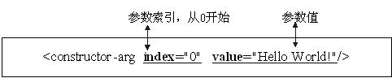
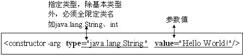

Spring DI
=========

###1、依赖和依赖注入
- **泛化**：表示类与类之间的继承关系、接口与接口之间的继承关系。

- **实现**：表示类对接口的实现。

- **依赖**：当类与类之间有使用关系时就属于依赖关系，不同于关联关系，依赖不具有“拥有关系”，而是一种“相识关系”，只在某个特定地方（比如某个方法体内）才有关系。

- **关联**：表示类与类或类与接口之间的依赖关系，表现为“拥有关系”；具体到代码可以用实例变量来表示。

- **聚合**：属于是关联的特殊情况，体现部分-整体关系，是一种弱拥有关系；整体和部分可以有不一样的生命周期；是一种弱关联。

- **组合**：属于是关联的特殊情况，也体现了体现部分-整体关系，是一种强“拥有关系”；整体与部分有相同的生命周期，是一种强关联。

**Spring IoC容器的依赖**有两层含义：**Bean依赖容器**和**容器注入Bean的依赖资源**：
- **Bean依赖容器**：也就是说Bean要依赖于容器，这里的依赖是指容器负责创建Bean并管理Bean的生命周期，正是由于由容器来控制创建Bean并注入依赖，也就是控制权被反转了，这也正是IoC名字的由来，此处的有依赖是指Bean和容器之间的依赖关系。

- **容器注入Bean的依赖资源**：容器负责注入Bean的依赖资源，依赖资源可以是Bean、外部文件、常量数据等，在Java中都反映为对象，并且由容器负责组装Bean之间的依赖关系，此处的依赖是指Bean之间的依赖关系，可以认为是传统类与类之间的“关联”、“聚合”、“组合”关系。
 
**依赖注入**的**好处**：
- **动态替换Bean依赖对象，程序更灵活**：替换Bean依赖对象，无需修改源文件：应用依赖注入后，由于可以采用配置文件方式实现，从而能随时动态的替换Bean的依赖对象，无需修改java源文件。

- **更好实践面向接口编程，代码更清晰**：在Bean中只需指定依赖对象的接口，接口定义依赖对象完成的功能，通过容器注入依赖实现。

- **更好实践优先使用对象组合，而不是类继承**：因为IoC容器采用注入依赖，也就是组合对象，从而更好的实践对象组合。

    - 采用对象组合，Bean的功能可能由几个依赖Bean的功能组合而成，其Bean本身可能只提供少许功能或根本无任何功能，全部委托给依赖Bean，对象组合具有动态性，能更方便的替换掉依赖Bean，从而改变Bean功能；
    - 如果采用类继承，Bean没有依赖Bean，而是采用继承方式添加新功能，，而且功能是在编译时就确定了，不具有动态性，而且采用类继承导致Bean与子Bean之间高度耦合，难以复用。

- **增加Bean可复用性**：依赖于对象组合，Bean更可复用且复用更简单。

- **降低Bean之间耦合**：由于我们完全采用面向接口编程，在代码中没有直接引用Bean依赖实现，全部引用接口，而且不会出现显示的创建依赖对象代码，而且这些依赖是由容器来注入，很容易替换依赖实现类，从而降低Bean与依赖之间耦合。

- **代码结构更清晰**：要应用依赖注入，代码结构要按照规约方式进行书写，从而更好的应用一些最佳实践，因此代码结构更清晰。
 
**依赖注入只是一种装配对象的手段，设计的类结构才是基础**，如果设计的类结构不支持依赖注入，Spring IoC容器也注入不了任何东西，从而从根本上说“如何设计好类结构才是关键，依赖注入只是一种装配对象手段”。

**Spring IoC容器注入依赖资源**主要有以下两种基本**实现方式**：
- **构造器注入**：就是容器实例化Bean时注入那些依赖，通过在在Bean定义中指定构造器参数进行注入依赖，包括实例工厂方法参数注入依赖，但静态工厂方法参数不允许注入依赖。
- **setter注入**：通过setter方法进行注入依赖。
- 方法注入：能通过配置方式替换掉Bean方法，也就是通过配置改变Bean方法功能。
 

###2、构造器注入
**构造器注入**可以根据**参数索引注入**、**参数类型注入**或Spring3支持的**参数名注入**。

**【注】**
参数名注入是有限制的：
- 需要使用在编译程序时打开调试模式（即在编译时使用“javac –g:vars”在class文件中生成变量调试信息，默认是不包含变量调试信息的，从而能获取参数名字，否则获取不到参数名字）。
- 或在构造器上使用@ConstructorProperties（java.beans.ConstructorProperties）注解来指定参数名。

```java
// 构造器
public class HelloImpl3 implements HelloApi {

    private String message;
    private int index;

    public HelloImpl3(String message, int index) {
        this.message = message;
        this.index = index;
    }
    
    public void sayHello() {
        System.out.println(index + " says: " + message);
    }
}
```

####1）参数索引注入



```xml
<!-- 通过构造器参数索引方式依赖注入 -->
<bean id="bean3" class="com.sera.helloworld.HelloImpl3">
  <constructor-arg index="0" value="Hello spring!"></constructor-arg>
  <constructor-arg index="1" value="3"></constructor-arg>
</bean>
```
####2）参数类型进行注入



```xml
<!-- 通过构造器参数类型方式依赖注入 -->
<bean id="bean4" class="com.sera.helloworld.HelloImpl3">
  <constructor-arg type="java.lang.String" value="Hello spring!"></constructor-arg>
  <constructor-arg type="int" value="4"></constructor-arg>
</bean>
```
####3）参数名注入


```xml
<!-- 通过构造器参数名称方式依赖注入 -->
<bean id="bean5" class="com.sera.helloworld.HelloImpl3">
  <constructor-arg name="message" value="Hello spring!"></constructor-arg>
  <constructor-arg name="index" value="5"></constructor-arg>
</bean>
```

测试配置是否正常工作：
```java
@Test
public void testHelloWorld3() {
    ApplicationContext context = new ClassPathXmlApplicationContext("spring-config.xml");
    
    HelloApi bean3 = context.getBean("bean3", HelloApi.class);
    bean3.sayHello();
    
    HelloApi bean4 = context.getBean("bean4", HelloApi.class);
    bean4.sayHello();
    
    HelloApi bean5 = context.getBean("bean5", HelloApi.class);
    bean5.sayHello();
}
```

####静态工厂类
```java
// 静态工厂类
public class HelloApiStaticFactory {
    public static HelloApi newInstance(String message, int index) {
        return new HelloImpl3(message, index);
    }
}
```
```xml
<!-- 静态工厂类参数索引方式依赖注入 -->  
<bean id="bean6" class="com.sera.helloworld.HelloApiStaticFactory" factory-method="newInstance">  
  <constructor-arg index="0" value="Hello Spring!"/>
  <constructor-arg index="1" value="6"></constructor-arg>
</bean>
  
<!-- 静态工厂类参数类型方式依赖注入 -->  
<bean id="bean7" class="com.sera.helloworld.HelloApiStaticFactory" factory-method="newInstance">  
  <constructor-arg type="java.lang.String" value="Hello spring!"/>
  <constructor-arg name="index" value="7"></constructor-arg>
</bean>

<!-- 静态工厂类参数名称方式依赖注入  -->  
<bean id="bean8" class="com.sera.helloworld.HelloApiStaticFactory" factory-method="newInstance">  
  <constructor-arg name="message" value="Hello Spring!"/>
  <constructor-arg name="index" value="8"></constructor-arg>
</bean>
```
```java
@Test
public void testStaticFactory() {
    ApplicationContext context = new ClassPathXmlApplicationContext("spring-config.xml");
    
    HelloApi bean6 = context.getBean("bean6", HelloApi.class);
    bean6.sayHello();
    
    HelloApi bean7 = context.getBean("bean7", HelloApi.class);
    bean7.sayHello();
    
    HelloApi bean8 = context.getBean("bean8", HelloApi.class);
    bean8.sayHello();
}
```

####实例工厂类
```java
public class HelloApiInstanceFactory {
    public HelloApi newInstance(String message, int index) {
        return new HelloImpl3(message, index);
    }
}
```
```xml
  <!-- 定义实例工厂bean -->
<bean id="instanceFactory" class="com.sera.helloworld.HelloApiInstanceFactory"></bean>
  
<!-- 实例工厂类参数索引方式依赖注入 -->  
<bean id="bean9" factory-bean="instanceFactory" factory-method="newInstance">
  <constructor-arg index="0" value="Hello Spring!"/>
  <constructor-arg index="1" value="9"></constructor-arg>
</bean>

<!-- 实例工厂类参数类型方式依赖注入 -->  
<bean id="bean10" factory-bean="instanceFactory" factory-method="newInstance">
  <constructor-arg type="java.lang.String" value="Hello spring!"/>
  <constructor-arg name="index" value="10"></constructor-arg>
</bean>

<!-- 实例工厂类参数名称方式依赖注入  -->  
<bean id="bean11" factory-bean="instanceFactory" factory-method="newInstance">
  <constructor-arg name="message" value="Hello Spring!"/>
  <constructor-arg name="index" value="11"></constructor-arg>
</bean>
```
```java
@Test
public void testInstanceFactory() {
    ApplicationContext context = new ClassPathXmlApplicationContext("spring-config.xml");
    
    HelloApi bean9 = context.getBean("bean9", HelloApi.class);
    bean9.sayHello();
    
    HelloApi bean10 = context.getBean("bean10", HelloApi.class);
    bean10.sayHello();
    
    HelloApi bean11 = context.getBean("bean11", HelloApi.class);
    bean11.sayHello();
}
```


###3、setter注入
**setter注入**，是通过在通过构造器、静态工厂或实例工厂实例好Bean后，通过调用Bean类的setter方法进行注入依赖。


```java
public class HelloImpl4 implements HelloApi {

    private String message;
    private int index;

    public void setMessage(String message) {
        this.message = message;
    }

    public void setIndex(int index) {
        this.index = index;
    }

    public void sayHello() {
        System.out.println(index + " says: " + message);
    }
}
```
```xml
<bean id="bean12" class="com.sera.helloworld.HelloImpl4">  
  <property name="message" value="Hello World!"/>  
  <property name="index">  
    <value>12</value>  
  </property>  
</bean>
```
```java
@Test  
public void testSetterDependencyInject() {  
    BeanFactory beanFactory = new ClassPathXmlApplicationContext("spring-config.xml");  
    HelloApi bean = beanFactory.getBean("bean12", HelloApi.class);  
    bean.sayHello();  
}
```

**JavaBean**：是本质就是一个POJO类，但具有一下限制：
- 该类**必须要有公共的无参构造器**，如public HelloImpl4() {}。
- **属性为private访问级别**，不建议public，如private String message。
- 属性必要时通过一组**setter（修改器）和getter（访问器）方法**来访问；
- **setter方法，以“set”开头，后跟首字母大写的属性名**，如“setMesssage”,简单属性一般只有一个方法参数，方法返回值通常为“void”;
- **getter方法，一般属性以“get”开头，对于boolean类型一般以“is”开头，后跟首字母大写的属性名**，如“getMesssage”，“isOk”；
- 还有一些其他**特殊情况**，比如**属性有连续两个大写字母开头**，如“URL”,则setter/getter方法为：“setURL”和“getURL”，其他一些特殊情况请参看“Java Bean”命名规范。

###4、注入常量
注入常量的两种方式：
```xml
<property name="message" value="Hello World!"/>  
<!-- 或 -->
<property name="index"><value>12</value></property>  
```
**【注】** Spring类型转换系统对于boolean类型进行了容错处理，除了可以使用“true/false”标准的Java值进行注入，还能使用“yes/no”、“on/off”、“1/0”来代表“真/假”。
```xml
<!-- boolean参数值可以用on/off -->  
<bean id="beanOn" class="com.sera.helloworld.HelloImpl5">  
  <property name="success" value="on"/>  
</bean>  
<!-- boolean参数值可以用yes/no -->  
<bean id="beanYes" class="com.sera.helloworld.HelloImpl5">  
  <property name="success" value="yes"/>  
</bean>  
<!-- boolean参数值可以用1/0 -->  
<bean id="beanNum" class="com.sera.helloworld.HelloImpl5">  
  <property name="success" value="1"/>  
</bean>  
```
###5、注入bean ID
用于注入Bean的ID，ID是一个常量不是引用，且类似于注入常量，但提供错误验证功能，配置方式如下所示：
```xml
<!-- 方式一 -->
<property name="id"><idref bean="bean1"/></property>  

<!-- 方式二 -->
<property name="id"><idref local="bean2"/></property>  

<!-- 前两种方式等同于下面 -->
<bean id="bean1" class="……"/>  
<bean id="idrefBean1" class="……">  
  <property name="id" value ="bean1"/>  
</bean> 
```
**方式一与方式二比较**：
- **方式二**可以在容器初始化时校验**被引用的Bean**是否存在，如果**不存在将抛出异常**。
- **方式一**只有**在Bean实际使用时才能发现传入的Bean的ID是否正确**，可能发生不可预料的错误。
- 因此如果想注入Bean的ID，**推荐使用第二种方式**。

```java
public class IdRefTestBean {  
    private String id;  
    public String getId() {  
        return id;  
    }  
    public void setId(String id) {  
        this.id = id;  
    }  
} 
```
```xml
<bean id="bean1" class="java.lang.String">  
  <constructor-arg index="0" value="test"/>  
</bean>  
<bean id="bean2" class="java.lang.String">  
  <constructor-arg index="0" value="test"/>  
</bean>  

<bean id="idrefBean1" class="cn.javass.spring.chapter3.bean.IdRefTestBean">  
  <property name="id"><idref bean="bean1"/></property>  
</bean>  
<bean id="idrefBean2" class="cn.javass.spring.chapter3.bean.IdRefTestBean">  
  <property name="id"><idref local="bean2"/></property>  
</bean>
```

###6、注入集合
**注入集合**类型：包括**Collection类型**、**Set类型**、**List类型数据**。
```java
public class ListBean {
    private List<String> values;

    public List<String> getValues() {
        return values;
    }

    public void setValues(List<String> values) {
        this.values = values;
    }
}

public class CollectionBean {   
    private Collection<String> values;

    public Collection<String> getValues() {
        return values;
    }

    public void setValues(Collection<String> values) {
        this.values = values;
    }
}
```
```xml
<bean id="listBean" class="com.sera.inject.ListBean">  
  <property name="values">  
    <list>  
      <value>1</value>  
      <value>2</value>  
      <value>3</value>  
    </list>  
  </property>  
</bean>

<bean id="collectionBean" class="com.sera.inject.CollectionBean">  
  <property name="values">  
    <set>  
      <value>1</value>  
      <value>2</value>  
      <value>3</value>  
    </set>  
  </property>  
</bean>
```
```java
@Test
public void testListBean() {
    ApplicationContext context = new ClassPathXmlApplicationContext("spring-config.xml");
    ListBean listBean = context.getBean("listBean", ListBean.class);
    System.out.println(listBean.getValues().size());  
    Assert.assertEquals(3, listBean.getValues().size());  
}

@Test
public void testCollectionBean() {
    ApplicationContext context = new ClassPathXmlApplicationContext("spring-config.xml");
    CollectionBean collectionBean = context.getBean("collectionBean", CollectionBean.class);
    System.out.println(collectionBean.getValues().size());  
    Assert.assertEquals(3, collectionBean.getValues().size());  
}
```

###7、注入数组
使用`<array>`标签来配置注入，其中标签属性`“value-type”`和`“merge”`和`<list>`标签含义完全一样.
```java
public class ArrayBean {
    private String[] array;
    private String[][] array2;
    
    public void setArray(String[] array) {
        this.array = array;
    }
    
    public void setArray2(String[][] array2) {
        this.array2 = array2;
    }
}
```
```xml
<bean id="arrayBean" class="com.sera.inject.ArrayBean"> 
  <!-- 一维数组注入 --> 
  <property name="array">  
    <array value-type="java.lang.String" merge="default">  
      <value>1</value>  
      <value>2</value>  
    </array>  
  </property>  
  <!-- 二维数组注入 --> 
  <property name="array2">  
    <array>  
      <array>
        <value>1</value>
      </array>
      <array>
        <value>2</value>
      </array> 
    </array>  
  </property>
</bean>
```
###8、注入字典Map
**字典类型**是包含键值对数据的数据结构，需要使用`<map>`标签来配置注入，其属性`“key-type”`和`“value-type”`分别指定`“键”`和`“值”`的数据类型，其含义和`<list>`标签的“value-type”含义一样，并使用`<key>`子标签来指定键数据，`<value>`子标签来指定键对应的值数据。
```java
public class MapBean {
    private Map<String, String> values;

    public Map<String, String> getValues() {
        return values;
    }

    public void setValues(Map<String, String> values) {
        this.values = values;
    }  
}
```
```xml
<bean id="mapBean" class="com.sera.inject.MapBean"> 
  <property name="values">  
    <map key-type="java.lang.String" value-type="java.lang.String">
      <entry>
        <key><value>1</value></key>
        <value>11</value>
      </entry>
      <entry key="2" value="22"></entry>
    </map>
  </property>
</bean>
```

###9、注入Properties
Spring能注入java.util.Properties类型数据，需要使用`<props>`标签来配置注入，键和值类型必须是String，不能变，子标签`<prop key=”键”>值</prop>`来指定键值对。
```java
public class PropertiesBean {
    private Properties values;

    public Properties getValues() {
        return values;
    }

    public void setValues(Properties values) {
        this.values = values;
    }   
}
```
```xml
<bean id="propertiesBean" class="com.sera.inject.PropertiesBean"> 
  <property name="values">  
    <props value-type="int" merge="default">
      <prop key="1">less</prop>
      <prop key="2">2</prop>
    </props>
  </property>
</bean>
```
###10、引用其它bean
引用其他Bean的步骤与注入常量的步骤一样，可以通过构造器注入及setter注入引用其他Bean，只是引用其他Bean的注入配置稍微变化了一下：可以将`“<constructor-arg index="0" value="Hello World!"/>”`和`“<property name="message" value="Hello World!"/>”`中的value属性替换成bean属性，其中bean属性指定配置文件中的其他Bean的id或别名。另一种是把`<value>`标签替换为`<.ref bean=”beanName”>`，bean属性也是指定配置文件中的其他Bean的id或别名。
```java
public class HelloApiDecorator implements HelloApi {
    
    private HelloApi helloApi; 
    
    // 构造器
    public HelloApiDecorator() {
        
    }  
    // 有参构造器  
    public HelloApiDecorator(HelloApi helloApi) {  
        this.helloApi = helloApi;  
    }    
    
    public void setHelloApi(HelloApi helloApi) {  
        this.helloApi = helloApi;  
    }  

    public void sayHello() {  
        helloApi.sayHello();    
    }
}
```
####1）构造器注入方式
（1）通过”`<constructor-arg>`”标签的ref属性来引用其他Bean，这是最简化的配置：
```xml
<bean id="helloApi" class="com.sera.helloworld.HelloImpl"/>  
<bean id="beanConstructor" class="com.sera.helloworld.HelloApiDecorator">  
  <constructor-arg index="0" ref="helloApi"/>  
</bean>
```
（2）通过”`<constructor-arg>`”标签的子`<ref>`标签来引用其他Bean，使用bean属性来指定引用的Bean：
```xml
<bean id="helloApi" class="com.sera.helloworld.HelloImpl"/>  
<bean id="beanConstructor" class="com.sera.helloworld.HelloApiDecorator">  
  <constructor-arg index="0"><ref bean="helloApi"></ref></constructor-arg>
</bean>
```
####2）setter注入方式
（1）通过”`<property>`”标签的ref属性来引用其他Bean，这是最简化的配置：
```xml
<bean id="helloApi" class="com.sera.helloworld.HelloImpl"/>  
<bean id="beanSetter" class="com.sera.helloworld.HelloApiDecorator">  
  <property name="helloApi" ref="helloApi"/>  
</bean>
```
（2）通过”`<property>`”标签的子`<ref>`标签来引用其他Bean，使用bean属性来指定引用的Bean：
```xml
<bean id="helloApi" class="com.sera.helloworld.HelloImpl"/>  
<bean id="beanSetter" class="com.sera.helloworld.HelloApiDecorator">  
  <property name="helloApi"><ref bean="helloApi"/></property>  
</bean>
```
####3）其他注入方式
（1）**`<ref local=””/>`配置方式**：用于引用通过`<bean id=”beanName”>`方式中通过id属性指定的Bean，它能利用XML解析器的验证功能在读取配置文件时来验证引用的Bean是否存在。因此如果**在当前配置文件中有相互引用**的Bean可以采用`<ref local>`方式从而如果配置错误能在开发调试时就发现错误。


（2）**`<ref parent=””/>`配置方式**：用于**引用父容器中的Bean**，不会引用当前容器中的Bean，当然父容器中的Bean和当前容器的Bean是可以重名的，获取顺序是直接到父容器找。

###11、定义内部bean
**内部Bean**就是在`<property>`或`<constructor-arg>`内通过`<bean>`标签定义的Bean，该Bean不管是否指定id或name，该Bean都会有唯一的匿名标识符，而且不能指定别名，该内部Bean对其他外部Bean不可见。
```xml
<bean id="bean" class="com.sera.helloworld.HelloApiDecorator">  
  <property name="helloApi">  
    <bean id="helloApi" class="com.sera.helloworld.HelloImpl"/>  
  </property>  
</bean>
```
###12、处理null值
Spring通过`<value>`标签或value属性注入常量值，所有注入的数据都是字符串，那如何注入null值呢？通过“null”值吗？当然不是因为如果注入“null”则认为是字符串。**Spring通过`<null/>`标签注入null值**。
```xml
<bean id="bean" class="com.sera.helloworld.HelloImpl4">  
  <property name="message"><null/></property>  
  <property name="index" value="1"/>
</bean>
```
