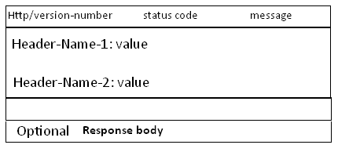

HTTP 协议详解
=====================

###1、什么是HTTP协议
   协议是指计算机通信网络中两台计算机之间进行通信所必须共同遵守的规定或规则，**超文本传输协议(HTTP)**是一种通信协议，它允许将**超文本标记语言(HTML)文档**从**Web服务器**传送到**客户端的浏览器**。
   目前我们使用的是**HTTP/1.1**版本。
   
###2、Web服务器，浏览器，代理服务器
　　实际上输入URL后，浏览器给Web服务器发送了一个Request，Web服务器接到Request后进行处理，生成相应的Response，然后发送给浏览器，浏览器解析Response中的HTML,这样就看到了网页。Request有可能是经过了代理服务器，最后才到达Web服务器的。

**代理服务器**就是**网络信息的中转站**。
**代理服务器**的**功能**：
- 1）提高访问速度，大多数的代理服务器都有缓存功能。
- 2）突破限制，也就是翻墙了。
- 3）隐藏身份。


###3、URL详解
**URL**(Uniform Resource Locator) 地址用于描述一个网络上的资源。
基本格式如下：
```
schema://host[:port#]/path/.../[;url-params][?query-string][#anchor]
```

|           | 说明|
| :-------- |:--------|
| scheme    | 指定低层使用的协议(例如：http, https, ftp)| 
| host      | HTTP服务器的IP地址或者域名|
| port#     | HTTP服务器的默认端口是80，这种情况下端口号可以省略。如果使用了别的端口，必须指明，例如 http://www.cnblogs.com:8080/|
| path      | 访问资源的路径|
| url-params|         |
| query-string | 发送给http服务器的数据 |
| anchor-   | 锚| 
　　
URL 的一个例子：
```
http://www.mywebsite.com/sj/test;id=8079?name=sviergn&x=true#stuff
```
- Schema: http
- host: www.mywebsite.com
- path: /sj/test
- URL params: id=8079
- Query String: name=sviergn&x=true
- Anchor: stuff

###4、HTTP协议是无状态的
**http协议**是**无状态**的，同一个客户端的这次请求和上次请求是没有对应关系，对http服务器来说，它并不知道这两个请求来自同一个客户端。 

为了解决这个问题， Web程序引入了**Cookie机制**来**维护状态**。

###5、HTTP消息的结构
**Request 消息**分为3部分，第一部分叫**请求行**，第二部分叫**http header**，第三部分是**body**。

**header和body之间有个空行**，结构如下图：


第一行中的**Method**表示**请求方法**，比如"POST"，"GET"，  **Path-to-resoure**表示**请求的资源**， **Http/version-number** 表示**HTTP协议的版本号**。

**Response 消息**也分为三部分，第一部分叫**request line**, 第二部分叫**request header**，第三部分是**body**。

**header和body之间也有个空行**，结构如下图：



**HTTP/version-number**表示**HTTP协议的版本号**，status-code 和message 请看下节[状态代码]的详细解释。

###6、Get和Post方法的区别
**Http协议**定义了很多**与服务器交互的方法**，**最基本**的有**4种**，分别是**GET**，**POST**，**PUT**，**DELETE**。

一个URL地址用于描述一个网络上的资源，而**HTTP中的GET, POST, PUT, DELETE**就**对应**着对这个**资源的查，改，增，删4个操作**。

我们最常见的就是GET和POST了。**GET**一般用于**获取/查询资源信息**，而**POST**一般用于**更新资源信息**。

**GET**和**POST**的**区别**：
- 1） **GET提交的数据会放在URL之后，以?分割URL和传输数据，参数之间以&相连。**如EditPosts.aspx?name=test1&id=123456。**POST方法是把提交的数据放在HTTP包的Body中**。
- 2） **GET提交的数据大小有限制**（因为浏览器对URL的长度有限制），而**POST方法提交的数据没有限制**。
- 3） **GET方式需要使用Request.QueryString来取得变量的值**，而**POST方式通过Request.Form来获取变量的值**。
- 4） **GET方式提交数据，会带来安全问题**，比如一个登录页面，通过GET方式提交数据时，用户名和密码将出现在URL上，如果页面可以被缓存或者其他人可以访问这台机器，就可以从历史记录获得该用户的账号和密码。


###7、状态码
**Response 消息**中的第一行叫做状态行，由**HTTP协议版本号**， **状态码**， **状态消息** 三部分组成。
**状态码**用来**告诉HTTP客户端**，**HTTP服务器是否产生了预期的Response**.
**HTTP/1.1**中定义了**5类状态码**，**状态码**由**三位数字**组成，**第一个数字**定义了**响应的类别**。
- **1XX  提示信息** - 表示请求已被成功接收，继续处理。
- **2XX  成功** - 表示请求已被成功接收，理解，接受。
- **3XX  重定向** - 要完成请求必须进行更进一步的处理。
- **4XX  客户端错误** -  请求有语法错误或请求无法实现。
- **5XX  服务器端错误** -   服务器未能实现合法的请求。

常见的状态码：

| 状态码     |    详情   |    说明   |   
| :--------: | :-------- | :-------- |
| 200        |    OK     | 表明该请求被成功地完成，所请求的资源发送回客户端 |
| 302        | Found     | 重定向，新的URL会在response中的Location中返回，浏览器将会使用新的URL发出新的Request。|
| 304        | Not Modified  | 代表上次的文档已经被缓存了， 还可以继续使用。|
| 400        | Bad Request   | 客户端请求与语法错误，不能被服务器所理解。|
| 403        | Forbidden     | 服务器收到请求，但是拒绝提供服务。|
| 404        | Not Found     | 请求资源不存在（输错了URL）。|
| 500        | Internal Server Error | 服务器发生了不可预期的错误。|
| 503        | Server Unavailable    | 服务器当前不能处理客户端的请求，一段时间后可能恢复正常。|

###8、HTTP Request header
header 有很多，比较难以记忆，我们也按照Fiddler那样把header 进行分类，这样比较清晰也容易记忆。
####Cache 头域
|            |   作用    |
| :--------: | :-------- |
| If-Modified-Since        |    把浏览器端缓存页面的最后修改时间发送到服务器去，服务器会把这个时间与服务器上实际文件的最后修改时间进行对比。如果时间一致，那么返回304，客户端就直接使用本地缓存文件。如果时间不一致，就会返回200和新的文件内容。客户端接到之后，会丢弃旧文件，把新文件缓存起来，并显示在浏览器中。     |
| If-None-Match        |    If-None-Match和ETag一起工作，工作原理是在HTTP Response中添加ETag信息。 当用户再次请求该资源时，将在HTTP Request 中加入If-None-Match信息(ETag的值)。如果服务器验证资源的ETag没有改变（该资源没有更新），将返回一个304状态告诉客户端使用本地缓存文件。否则将返回200状态和新的资源和Etag.  使用这样的机制将提高网站的性能。     |
| Pragma        |    防止页面被缓存，在HTTP/1.1版本中，它和Cache-Control:no-cache作用一模一样。注意: 在HTTP/1.0版本中，只实现了Pragema:no-cache, 没有实现Cache-Control。 |
| Cache-Control        | 这个是非常重要的规则。 这个用来指定Response-Request遵循的缓存机制。各个指令含义如下：Cache-Control:Public 可以被任何缓存所缓存（）；Cache-Control:Private 内容只缓存到私有缓存中；Cache-Control:no-cache 所有内容都不会被缓存。 |

####Client 头域

|            |   作用    |    实例   |   
| :--------: | :-------- | :-------- |
| Accept  | 浏览器端可以接受的媒体类型。如果服务器无法返回text/html类型的数据，服务器应该返回一个406错误(non acceptable)。通配符`*`代表任意类型。 | Accept: text/html  代表浏览器可以接受服务器回发的类型为 text/html  也就是我们常说的html文档。Accept: `*/*` 代表浏览器可以处理所有类型，(一般浏览器发给服务器都是发这个)。 |
| Accept-Encoding | 浏览器申明自己接收的编码方法，通常指定压缩方法，是否支持压缩，支持什么压缩方法（gzip，deflate），（注意：这不是只字符编码）。 | Accept-Encoding: gzip, deflate  |
| Accept-Language | 浏览器申明自己接收的语言。语言跟字符集的区别：中文是语言，中文有多种字符集，比如big5，gb2312，gbk等。 | Accept-Language: en-us |
| User-Agent | 告诉HTTP服务器， 客户端使用的操作系统和浏览器的名称和版本。 | User-Agent: Mozilla/4.0 (compatible; MSIE 8.0; Windows NT 5.1; Trident/4.0; CIBA; .NET CLR 2.0.50727; .NET CLR 3.0.4506.2152; .NET CLR 3.5.30729; .NET4.0C; InfoPath.2; .NET4.0E) |
| Accept-Charset | 浏览器申明自己接收的字符集，这就是本文前面介绍的各种字符集和字符编码，如gb2312，utf-8（通常我们说Charset包括了相应的字符编码方案）。 |  . |

####Cookie/Login 头域
|            |   作用    |
| :--------: | :-------- |
| Cookie | 最重要的header, 将cookie的值发送给HTTP 服务器。 |

####Entity头域
|            |   作用    |    实例   |   
| :--------: | :-------- | :-------- |
| Content-Length | 发送给HTTP服务器数据的长度。 | Content-Length: 38 |
| Content-Type |  | Content-Type: application/x-www-form-urlencoded |

####Miscellaneous 头域
|            |   作用    |    实例   |   
| :--------: | :-------- | :-------- |
| Referer | 提供了Request的上下文信息的服务器，告诉服务器我是从哪个链接过来的，比如从我主页上链接到一个朋友那里，他的服务器就能够从HTTP Referer中统计出每天有多少用户点击我主页上的链接访问他的网站。 | Referer:http://translate.google.cn/?hl=zh-cn&tab=wT |

####Transport 头域
|            |   作用    |    实例   |   
| :--------: | :-------- | :-------- |
| Connection | 当一个网页打开完成后，客户端和服务器之间用于传输HTTP数据的TCP连接不会关闭，如果客户端再次访问这个服务器上的网页，会继续使用这一条已经建立的连接。 | Connection: keep-alive |
| Connection | 代表一个Request完成后，客户端和服务器之间用于传输HTTP数据的TCP连接会关闭， 当客户端再次发送Request，需要重新建立TCP连接。 | Connection: close |
| Host（发送请求时，该报头域是必需的） | 请求报头域主要用于指定被请求资源的Internet主机和端口号，它通常从HTTP URL中提取出来的。 | 我们在浏览器中输入：http://www.guet.edu.cn/index.html。浏览器发送的请求消息中，就会包含Host请求报头域 Host：http://www.guet.edu.cn ，此处使用缺省端口号80，若指定了端口号，则变成：Host：指定端口号。 |

###9、HTTP Response header

我们也按照Fiddler那样把header 进行分类，这样比较清晰也容易记忆。
####Cache头域
|            |   作用    |    实例   |   
| :--------: | :-------- | :-------- |
| Date | 生成消息的具体时间和日期。 | Date: Sat, 11 Feb 2012 11:35:14 GMT |
| Expires | 浏览器会在指定过期时间内使用本地缓存。 | Expires: Tue, 08 Feb 2022 11:35:14 GMT |
| Vary |   | Vary: Accept-Encoding |

####Cookie/Login 头域
|            |   作用    |    实例   |   
| :--------: | :-------- | :-------- |
| P3P | 用于跨域设置Cookie, 这样可以解决iframe跨域访问cookie的问题。 | P3P: CP=CURa ADMa DEVa PSAo PSDo OUR BUS UNI PUR INT DEM STA PRE COM NAV OTC NOI DSP COR |
| Set-Cookie | 非常重要的header, 用于把cookie 发送到客户端浏览器，每一个写入cookie都会生成一个Set-Cookie。 | Set-Cookie: sc=4c31523a; path=/; domain=.acookie.taobao.com |

####Entity头域
|            |   作用    |    实例   |   
| :--------: | :-------- | :-------- |
| ETag | 和If-None-Match 配合使用。 | ETag: "03f2b33c0bfcc1:0" |
| Last-Modified | 用于指示资源的最后修改日期和时间。 |  Last-Modified: Wed, 21 Dec 2011 09:09:10 GMT |
| Content-Type | WEB服务器告诉浏览器自己响应的对象的类型和字符集。 | Content-Type: text/html; charset=utf-8  ；  Content-Type:text/html;charset=GB2312  ；  Content-Type: image/jpeg |
| Content-Length | 指明实体正文的长度，以字节方式存储的十进制数字来表示。在数据下行的过程中，Content-Length的方式要预先在服务器中缓存所有数据，然后所有数据再一股脑儿地发给客户端。 | Content-Length: 19847 |
| Content-Encoding | WEB服务器表明自己使用了什么压缩方法（gzip，deflate）压缩响应中的对象。 | Content-Encoding：gzip |
| Content-Language | WEB服务器告诉浏览器自己响应的对象的语言者。 | Content-Language:da |

####Miscellaneous 头域
|            |   作用    |    实例   |   
| :--------: | :-------- | :-------- |
| Server | 指明HTTP服务器的软件信息。 | Server: Microsoft-IIS/7.5 |
| X-AspNet-Version | 如果网站是用ASP.NET开发的，这个header用来表示ASP.NET的版本。 | X-AspNet-Version: 4.0.30319 |
| X-Powered-By | 表示网站是用什么技术开发的。 | X-Powered-By: ASP.NET |

####Transport头域
|            |   作用    |    实例   |   
| :--------: | :-------- | :-------- |
| Connection | 当一个网页打开完成后，客户端和服务器之间用于传输HTTP数据的TCP连接不会关闭，如果客户端再次访问这个服务器上的网页，会继续使用这一条已经建立的连接。 | Connection: keep-alive |
| Connection | 代表一个Request完成后，客户端和服务器之间用于传输HTTP数据的TCP连接会关闭， 当客户端再次发送Request，需要重新建立TCP连接。 | Connection: close |
  
####Location头域
|            |   作用    |
| :--------: | :-------- |
| Location | 用于重定向一个新的位置， 包含新的URL地址 |

###10、HTTP协议是无状态的和Connection: keep-alive的区别
**无状态**是指**协议对于事务处理没有记忆能力**，服务器不知道客户端是什么状态。从另一方面讲，打开一个服务器上的网页和你之前打开这个服务器上的网页之间没有任何联系。
　　
**HTTP是一个无状态的面向连接的协议**，**无状态不代表HTTP不能保持TCP连接**，更不能代表HTTP使用的是UDP协议（无连接）。
　　
从**HTTP/1.1**起，**默认都开启了Keep-Alive**，**保持连接特性**。简单地说，当一个网页打开完成后，客户端和服务器之间用于传输HTTP数据的TCP连接不会关闭，如果客户端再次访问这个服务器上的网页，会继续使用这一条已经建立的连接。
　　
**Keep-Alive不会永久保持连接**，它有一个保持时间，可以在不同的服务器软件（如Apache）中设定这个时间。
