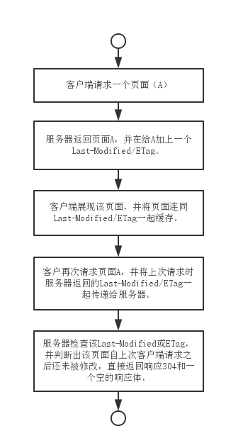

http 响应 Last-Modified 和 ETag
==============

###1、Last-Modified

　　在浏览器**第一次请求**某一个 URL 时，**服务器端的返回状态**会是 **200**，**内容**是你**请求的资源**，同时有一个 **Last-Modified** 的属性标记此文件在服务期端最后被修改的时间，格式类似这样：

```
　　Last-Modified: Fri, 12 May 2006 18:53:33 GMT
```

　　客户端**第二次请求**此 URL 时，根据 HTTP 协议的规定，浏览器会向服务器传送 **If-Modified-Since** 报头，询问该时间之后文件是否有被修改过：

```
　　If-Modified-Since: Fri, 12 May 2006 18:53:33 GMT
```

　　如果**服务器端的资源没有变化**，则自动**返回 HTTP 304 （Not Changed）状态码**，**内容为空**，这样就节省了传输数据量。当**服务器端代码发生改变**或者**重启服务器**时，则**重新发出资源**，**返回和第一次请求时类似**。从而保证不向客户端重复发出资源，也保证当服务器有变化时，客户端能够得到最新的资源。
　　
###2、Etag

　　HTTP 协议规格说明定义 **ETag** 为“**被请求变量的实体值**”。另一种说法是，**ETag** 是一个可以与 Web 资源关联的记号（**token**）。　　

　　典型的 Web 资源可以是一个 Web 页，也可能是 JSON 或 XML 文档。**服务器单独负责判断记号是什么及其含义**，并在 HTTP 响应头中将其传送到客户端，以下是服务器端返回的格式：

```
　　ETag: "50b1c1d4f775c61:df3"
```

　　客户端的查询更新格式是这样的：

```
　　If-None-Match: W/"50b1c1d4f775c61:df3"
```

　　如果 **ETag** 没改变，则**返回状态 304** 然后不返回，这也和 **Last-Modified** 一样。本人测试 **Etag主要在断点下载时比较有用**。
　　
###3、性能优化
　　**Last-Modified** 和 **Etags** 如何帮助**提高性能**?

　　聪明的开发者会把 **Last-Modified 和 ETags 请求的 http 报头一起使用**，这样可**利用客户端**（例如浏览器）的**缓存**。因为服务器首先产生 **Last-Modified/Etag 标记**，服务器可在稍后**使用它来判断页面是否已经被修改**。*本质上，客户端通过将该记号传回服务器要求服务器验证其（客户端）缓存。*

###4、实现

