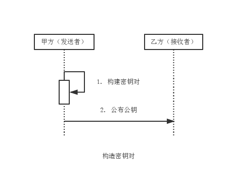
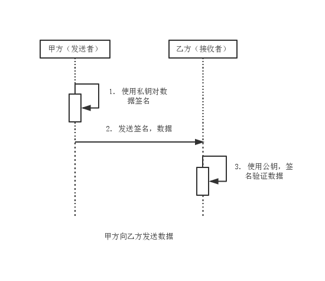

RSA
===

**数字签名算法**可以看做是一种**带有密钥的消息摘要算法**，且**该密钥包括公钥和私钥**。可见**数字签名算法**是**非对称加密算法**和**消息摘要算法**的**结合体**。

**消息摘要算法**要求能够**验证数据完整性**，**认证数据来源**，并起到**抗否认**的作用。

**消息摘要算法是验证数据完整性的最佳算法。**

**鉴别数据来源表示签名操作**必须由**发送方完成**，因此必然是基于发送方的私有信息完成的操作。
**验证签名操作**则由**乙方完成**，而用于验证操作的信息由发送放公布给接收方。
用于**签名的相关信息私有**，用于**验证的相关信息公有**，且**这两种信息必须成对出现**。非对称加密算法中的公私钥满足该关系。

**数字签名算法**包括**签名**和**验证**两项操作，遵循**私钥签名**，**公钥验证**的签名/验证方式。**签名时**需要使用**私钥和待签名数据**，**验证时**则需要**公钥，签名值和待签名数据**，其**核心算法**主要是**消息摘要算法**。因此**数字签名算法**可认为是**附加了公钥和私钥的消息摘要算法**。

与摘要值的表示方式相同，**签名值**也常以**十六进制字符串的形式表示**。

签名算法在实际运用时，通常是**先使用消息摘要算法对原始消息做摘要处理**，**然后再使用私钥对摘要值做签名处理**；**验证签名时，则使用公钥验证消息的摘要值**。

常见的**数字签名算法**包括**RSA**，**DSA**，**ECDSA**三种。**RSA**基于**整数因子分解问题**，**DSA和ECDSA**基于**离散对数问题**。

### 数字签名算法消息传递模型

1. 由消息发送方构建密钥对，这里由甲方完成。
2. 由消息发送方公布公钥至消息接收方，这里由甲方将公钥公布给乙方。

3. **［注］** 如加密算法区别，这里甲方使用私钥对数据签名，数据与签名形成一则消息发送给乙方，私钥仅用于签名，公钥仅用于验证。

### RSA

RSA数字签名算法源于RSA公钥密码算法的思想，将RSA公钥密码算法按照数字签名的方式运用。RSA数字签名算法是迄今为止应用最为广泛的数字签名算法。
RSA数字签名算法的实现如RSA加密算法一致。**RSA数字签名算法**主要可分为**MD系列**和**SHA系列**。

1. **MD系列**主要包括：**MD2withRSA**和**MD5withRSA**。
2. **SHA系列**主要包括：**SHA1withRSA**，**SHA224withRSA**，**SHA256withRSA**，**SHA384withRSA**，**SHA512withRSA**。

Java 6提供了MD2withRSA，MD5withRSA，SHA1withRSA支持，其他四中SHA算法第三方加密组建包Bouncy Castle提供支持。
