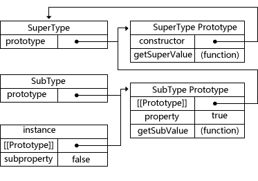
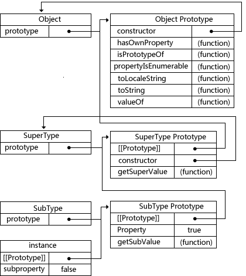

JavaScript继承
=========

###1、原型链
**构造函数、原型、实例之间的关系：**
- *1、每个构造函数都有一个原型对象*
- *2、原型对象都包含一个指向构造函数的指针*
- *3、实例都包含一个指向原型对象的内部指针*

**原型链**————让原型对象等于另一个类型的实例，此时的原型对象包含一个指向另一个原型的指针，相应地，另一个原型中也包含着一个指向另一个构造函数的指针。若另一个原型又是另一个类型的实例，上述关系依然成立，层层递推，就构成了实例与原型的链条。
```javascript
function SuperType() {
    this.property = true;
}

SuperType.prototype.getSuperValue = function() {
    return this.property;
}

function SubType() {
    this.subproperty = false;
}

SubType.prototype = new SuperType();

SubType.prototype.getSubValue = function() {
    return this.subproperty;
}

var instance = new SubType();
alert(instance.getSuperValue()); // true

alert(instance instanceof Object);    // true
alert(instance instanceof SuperType); // true
alert(instance instanceof SubType);   // true

alert(Object.prototype.isPrototypeOf(instance));    // true
alert(SuperType.prototype.isPrototypeOf(instance)); // true
alert(SubType.prototype.isPrototypeOf(instance));   // true
```
**继承的本质就是用一个新类型的实例重写原型对象。**



上述代码，没有使用SubType默认提供的原型，用SuperType的实例给它换了一个新原型。因此，新原型不仅具有作为一个SuperType的实例所拥有的全部属性和方法，而且其内部还有一个指针，指向了SuperType的原型。

最终结果是：
- 1）instance指向SubType原型，SubType原型内部有一个指针，指向SuperType的原型。
- 2）getSuperValue()方法在SuperType.prototype中，但property位于SubType原型中。因为property是一个实例属性，而getSuperValue()是一个原型方法。SubType原型是SuperType的实例，因此property位于SubType原型中。

**【注】**
instance.constructor现在指向的是SuperType，因为SubType的原型指向了另一个对象——SuperType的原型，而这个原型对象的constructor属性指向的是SuperType。

**通过实现原型链，本质上扩展了原型搜索机制。**
- *当以读取模式访问一个实例属性时，首先会在实例中搜索该属性。*
- *如果没有找到该属性，则会继续搜索实例的原型。*
- *在通过原型链实现继承的情况下，搜索过程就得以沿着原型链继续向上。*

调用instance.getSuperValue()会经历三个搜索步骤：

- 1）搜索实例；
- 2）搜索SubType.prototype；
- 3）搜索SuperType.prototype，最后一步才会找到该方法。

在找不到属性或方法的情况下，搜索过程总是要一环一环地前行到原型链末端才会停下来。
####1）别忘记默认的原型
**所有引用类型默认都继承了Object**，而这个继承也是通过原型链实现的。**所有函数的默认原型都是Object的实例**，因此默认原型都会包含一个指针，指向Object.prototype。这也正是所有自定义类型都会继承toString()、ValueOf()等默认方法的根本原因。

完整的原型链如下所示：



SubType继承了SuperType，而SuperType继承了Object。当调用instance.toString()时，实际上调用的是保存在Object.prototype中的那个方法。

####2）确定原型和实例的关系
通过两种方法来确定原型和实例之间的关系：
- 第一种方式是使用**instanceof操作符**
 
**只要用这个操作符来测试实例与原型中出现过的构造函数，结果就会返回true。**
```javascript
alert(instance instanceof Object);     //true
alert(instance instanceof SuperType);  //true
alert(instance instanceof SubType);    //true
```
由于原型链的关系，可以说instance是Object、SuperType或SubType中任何一个类型的实例。因此，测试这三个构造函数的结果都返回了true.
- 第二种方法是使用**isPrototypeOf()方法**

**只要是原型链中出现过的原型，都可以说是该原型链所派生的实例的原型**，因此isPrototypeOf()方法也返回ture。
```javascript
alert(Object.prototype.isPrototypeOf(instance));     //true
alert(SuperType.prototype.isPrototypeOf(instance));  //true
alert(SubType.prototype.isPrototypeOf(instance));    //true
```
####3）谨慎地定义方法
子类型有时候需要重写类型中的某个方法，或者需要添加超类型中不存在的某个方法。但不管怎样，给原型添加方法的代码一定要放在替换原型的语句之后。
```javascript
function SuperType() {
    this.property = true;
}

SuperType.prototype.getSuperValue = function() {
    return this.property;
};

function SubType() {
    this.subproperty = false;
}

//继承了SuperType()
SubType.prototype = new SuperType();

//添加了新方法
SubType.prototype.getSubValue = function() {
    return this.subproperty;
};

//重写超类型中的方法
SubType.prototype.getSuperValue = function() {
    return false;
};

var instance = new SubType();
alert(instance.getSuperValue()); //false
```
当通过SubType的实例调用getSuperValue()时，调用的就是这个重新定义的方法；但通过SuperType的实例调用getSuperValue()时，还会继续调用原来的那个方法。

**【注】**
- *1、必须在用SuperType的实例替换原型之后，再定义这两个方法。*
- *2、在通过原型链实现继承时，不能使用对象字面量创建原型方法。这样会重写原型链。*

```javascript
function SuperType() {
    this.property = true;
}

SuperType.prototype.getSuperValue = function() {
    return this.property;
};

function SubType() {
    this.subproperty = false;
}

//继承了SuperType
SubType.prototype = new SuperType();

//使用字面量添加新方法，会导致上一行代码无效
SubType.prototype = {
    getSubValue: function() {
        return this.subproperty;
    },
    someOtherMethod: function() {
        return false;
    }
};

var instance = new SubType();
alert(instance.getSuperValue()); //error!
```
把SuperType的实例赋值给原型，又将原型替换成一个对象字面量，由于替换后的原型包含的是一个Object的实例，而非SuperType的实例，因此原型链被切断——SubType和SuperType之间已经没有关系了。
####4）原型链的问题
**原型链的问题：**
- 最主要的问题来自*包含引用类型值的原型。*

包含引用类型值的原型属性会被所有实例共享，所以一般在构造函数中定义属性，在原型对象中定义方法。通过原型来实现继承时，原型会变成另一个类型的实例。于是，另一类型的实例属性也就顺理成章地变成了原型属性。
```javascript
function SuperType() {
    this.colors = ["red", "blue", "green"];
}

function SubType() {
}

//继承了SuperType
SubType.prototype = new SuperType();

var instancel = new SubType();
instancel.colors.push("black");
alert(instancel.colors); //"red,blue,green,black"

var instance2 = new SubType();
alert(instance2.colors); //"red,blue,green,black"
```
SuperType构造函数定义了一个colors属性，该属性包含一个数组(引用类型值)。SuperType的每个实例都会有各自包含自己数组的colors属性。当SubType通过原型链继承了SuperType之后，SubType.prototype就变成了SuperType的一个实例，SubType.prototype拥有了colors属性，SubType的所有实例都会共享这个colors属性。

- 原型链的第二个问题是：*在创建子类型的实例时，不能向超类型的构造函数中传递参数。*

**【注】**
实际上，没有办法在不影响所有对象实例的情况下，给超类型的构造函数传递参数。有鉴于此，再加上前面刚刚讨论过的由于原型中包含引用类型值所带来的问题，实践中很少会单独使用原型链。

###2、借用构造函数

###3、组合继承

###4、原型式继承

###5、寄生式继承

###6、寄生组合式继承