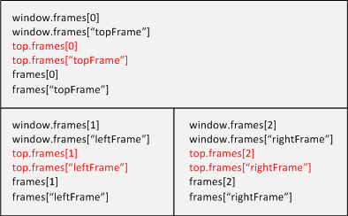
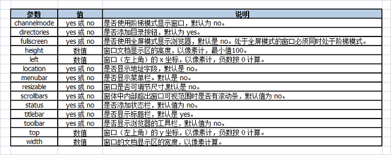
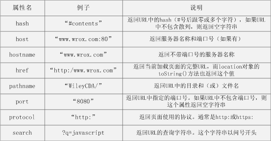

JavaScript BOM（浏览器对象模型）
=========

###1、window对象
window对象扮演者global对象角色，因此所有在全局作用域中声明的变量、函数都会变成window对象的属性和方法。

####1）窗口关系及框架
如果页面包含框架，则每个框架拥有自己的window对象，并且保存在frames集合中。在frames集合中，可以通过数值索引（从0开始，从左至右，从上至下）或者框架名称来访问相应的window对象。每个window对象都有一个name属性，其中包含框架的名称。
```html
<html>
  <head>
    <title>Frameset Example</title>
  </head>
  <frameset rows="160,*">
    <frame src="frame.htm" name="topFrame"/>
	<frameset cols="50%,50%">
	  <frame src="anotherframe.htm" name="leftFrame"/>
	  <frame src="yetanotherframe.htm" name="rightFrame"/>
	</frameset>
  </frameset>
</html>
```
创建了一个框架集，其中一个框架居上，两个框架居下，可以通过以下代码来访问上述框架。



top对象始终指向最高（最外）层框架，即浏览器窗口；window对象指向代码所在的当前框架，并非最高层框架。与top相对的另一个window对象是parent，parent对象始终指向当前框架的直接上层框架。在某些情况下，parent有可能等于top；在没有框架的情况下，parent一定等于top（此时它们等于window）。

```html
<!-- yetanotherframe.htm -->
<html>
  <head>
    <title>Frameset Example</title>
  </head>
  <frameset cols="50%,50%">
	<frame src="red.htm" name="redFrame"/>
	<frame src="blue.htm" name="blueFrame"/>
  </frameset>
</html>
```

浏览器在加载完第一个框架集之后，加载第二个框架集加载到rightFrame。如果代码位于redFrame（或blueFrame）中，那么parent对象指向的是rightFrame。如果代码位于topFrame中，则parent指向的是top，因为topFrame的直接上层框架就是最外层框架。

**【注】**
- *除非最高层窗口是通过window.open()打开的，否则其window对象的name属性不会包含任何值。*

- *与框架有关的最后一个对象是seft，它始终指向window；实际上，seft和window对象可以互换使用，引入seft对象只是为了与top和parent对应起来。*

- *在使用框架的情况下，浏览器中会存在多个Global对象。在每个框架中定义的全局变量会自动成为框架中window对象的属性。由于每个window对象都包含原生类型的构造函数，因此每个框架都有一套自己的构造函数，这些构造函数一一对应，但并不相等。*

####2）窗口位置
用来确定和修改window对象位置的属性和方法有很多。
 - **IE、Safari、Opera和Chrome**都提供了**screenLeft和screenTop属性**，分别用于表示窗口相对于屏幕左边和上边的位置。
 - **Firefox**则在**screenX和screenY属性**中提供相同的窗口位置信息，Safari和Chrome也同时支持这两个属性。
 - **Opera**虽然也支持screenX和screenY属性，但与screenLeft和screenTop属性并不对应，**尽量不要在Opera中使用screenX和screenY属性**。

跨浏览器取得窗口左边和上边的位置：
```javascript
var leftPos = (typeof window.screenLeft == "number") ? 
              window.screenLeft : window.screenX;
var topPos = (typeof window.screenTop == "number") ? 
              window.screenTop : window.screenY;
```

首先确定screenLeft和screenTop属性是否存在，如果存在（在IE、Safari、Opera和Chrome中），则取得这两个属性的值，如果不存在（在Firefox中），则取得screenX和screenY的值。

- *在IE、Opera和Chrome中，screenLeft和screenTop中保存的是从屏幕左边和上边到有window对象表示的页面可见区域的距离。即，如果window对象是最外层对象，而且浏览器窗口紧贴屏幕最上端——即y轴坐标为0，那么screenTop的值就是位于页面可见区域上方的浏览器工具栏的像素高度。*

- *在Safari和Firefox中，screenTop或screenY中保存的是整个浏览器窗口相对于屏幕的坐标值，即在窗口的y轴坐标为0时返回0。*

- *Firefox、Safari和Chrome始终返回页面中每个框架的top. screenX和top. screenY值。即使在页面由于被设置了外边距而发生偏移的情况下，相对于window对象使用screenX和screenY每次也都会返回相同的值。*

- *IE和Opera则会给出框架相对于屏幕边界的精确坐标轴。*

最终结果，就是无法跨浏览器取得窗口左边和上边的精确坐标值。使用**moveTo()和moveBy()**方法可能实现将窗口精确地移动到新位置。其中，**moveTo()**接收两个参数，新位置的x和y坐标值；**moveBy()**也接收两个参数，水平和垂直方向上移动的像素数。

```javascript
window.moveTo(0,0);     // 将窗口移动到屏幕左上角
window.moveTo(200,300); // 将窗口移动到(200,300)
window.moveTo(0,100);   // 将窗口向下移动100像素
window.moveTo(-50,0);   // 将窗口向左移动50像素
```

**【注】**
moveTo()和moveBy()方法可能被浏览器禁用，在Opera和IE7（及更高版本）中默认是禁用的。另外，这两种方法都不适用于框架，只能对最外层的window对象使用。

####3）窗口大小
**Firefox、Safari、Opera和Chrome提供4个属性：innerWidth、innerHeight、OuterWidth和outerHeight。**

- *在Safari和Firefox中，outerWidth和outerHeight返回浏览器窗口本身的尺寸（无论是从最外层的window对象还是从某个框架访问）。*

- *在Opera中，outerWidth和outerHeight的值表示页面视图容器的大小，而innerWidth和innerHeight则表示该容器中页面视图区的大小（减去边框宽度）。*

- *在Chrome中，outerWidth、outerHeight与innerWidth、innerHeight返回相同的值，即视口（viewport）大小而非浏览器窗口大小。*

- *IE没有提供取得当前浏览器窗口尺寸的属性，可以通过DOM提供了页面可见区域的相关信息。*

在**IE以及Firefox、Safari、Opera和Chrome**中，**document.documentElement.clientWidth**和**document.documentElement.clientHeight**中保存了**页面视口的信息**。

- 在**IE6**中，这些属性**必须在标准模式下才有效**，如果是混杂模式，就必须通过document.body.clientWidth和document.body.clientHeight取得相同信息。

- **混杂模式下的Chrome**，无论通过document.documentElement还是document.body中的clientWidth和clientHeight属性，都可以取得视口的大小。

**无法确定浏览器窗口本身大小，但是可以取得页面视口的大小**，如下所示：
```javascript
var pageWidth = window.innerWidth;
var pageHeight = window.innerHeight;

if (typeof pageWidth != "number") {
  if (document.compatMode == "CSS1Compat") {
    pageWidth = document.documentElement.clientWidth;
	pageHeight = document.documentElement.clientHeight;
  } else {
    pageWidth = document.body.clientWidth;
	pageHeight = document.body.clientHeight;
  }
}
```

使用**resizeTo()**和**resizeBy()**方法可以**调整浏览器窗口的大小**，两个方法都接受两个参数。其中，**resizeTo()接收浏览器窗口的新高度和新宽度**；**resizeBy()接收新窗口与原窗口的宽度和高度之差**。

**【注】**
- *resizeTo()和resizeBy()方法可能被浏览器禁用，在Opera和IE7（及更高版本）中默认是禁用的。*
- *resizeTo()和resizeBy()方法不适用于框架，只能对最外层的window对象使用。*

####4）导航和打开窗口
使用**window.open()方法**可以**导航到一个特定的url**，也可以**打开一个新的浏览器窗口**。

**window.open()**方法可以接受**4个参数**：
- *1、要加载的url*
- *2、窗口目标*
- *3、一个特性字符串*
- *4、一个表示新页面是否取代浏览器历史记录中当前加载页面的布尔值*

通常只需传递第一个参数，最后一个参数只在不打开新窗口的情况下使用。

- 如果给window.open()传递第二个参数，且该参数是已有窗口或框架的名称，则会在具有该名称的窗口或框架中加载第一个参数指定的url。第二个参数可以是以下**特殊的窗口名称**：**_self**、 **_parent**、 **_top**、** _blank**。

```javascript
// 等同于 <a href="http://www.wrox.com" target="topFrame"></a>
window.open("http://www.wrox.com", "topFrame");
```

- 如果给window.open()传递第二个参数并不是一个已经存在的窗口或框架，那么就会根据第三个参数传入的字符串创建一个新窗口或标签页。

```javascript
window.open("http://www.wrox.com", "wroxWindow", "height=400,width=400,top=10,left=10,resizable=yes");
```



- 如果给window.open()传递第二个参数并不是一个已经存在的窗口或框架，且没有传入第三个参数，会打开一个带有全部默认设置的新浏览器窗口或打开一个新标签页——根据浏览器设置决定。

```javascript
// 返回一个指向新窗口的引用
var wroxWindow = window.open("http://www.wrox.com", "wroxWindow", "height=400,width=400,top=10,left=10,resizable=yes");

// 调整大小
wroxWindow.resizeTo();

// 移动位置
wroxWindow.moveTo();

// 关闭窗口
wroxWindow.close();
```
这个方法只适用于window.open()打开的弹出窗口。对于浏览器的主窗口，如果没有得到用户的允许是不能关闭它的。弹出窗口可以调用top.close()在不经用户允许的情况下关闭自己。

**【注】**
- *新创建的window对象有一个opener属性，其中保存着打开它的原始窗口对象。这个属性只在弹出窗口的最外层window对象(top)中有定义，而且指向调用window.open()的窗口或框架。*
- *弹出窗口有一个指针指向打开它的原始窗口，但原始窗口中没有指针指向弹出窗口。窗口不跟踪记录它们打开的弹出窗口，必要时只能手动实现跟踪。*

####5）间歇调用和超时调用
```javascript
// 超时调用（推荐）
setTimeout(function() {
    alert("Hello World");
}, 1000);

// 超时调用（不建议使用）
setTimeout("alert('Hello World')", 1000);
```
```javascript
// 设置超时调用
var timeoutId = setTimeout(function() {
    alert("Hello World");
}, 1000);

// 取消超时调用
clearTimeout(timeoutId);
```
**【注】**
*超时调用的代码都是在全局作用域中执行的，因此函数中的this的值通常会指向window对象。*

```javascript
// 间隔调用（推荐）
setInterval(function() {
    alert("Hello World");
}, 1000);

// 间隔调用（不建议使用）
setInterval("alert('Hello World')", 1000);
```
**超时调用和间歇调用区别**：
*使用超时调用不跟踪超时调用ID；间歇调用跟踪间歇调用ID。*

**【注】**
一般使用超时调用来模拟间歇调用，在开发环境下，很少使用真正的间歇调用。

####6）系统对话框
**3种弹出式消息提醒（警告窗口alert，确认窗口confirm，信息输入窗口prompt）**
```javascript
// alert
alert("这是一个alert");

// confirm
if (confirm("需要保存么？")) {

} else {

}

// prompt
var name = prompt("請輸入你的名字", "你的名字 ");
// var name = prompt("請輸入你的名字", "") 
alert(name);  // name为输入的值
```

###2、location对象
**location是最有用的BOM之一**，它提供了与当前窗口中加载的文档有关的信息，还提供了一些导航功能。

**location对象**是很特别的对象，**既是window对象的属性，也是document对象的属性**，即**window.location和document.location引用的是同一个对象**。location对象的用处不只表现在它保存着当前文档的信息，还表现在它将URL解析为独立的片段，让开发人员可以通过不同的属性访问这些片段。



使用location对象可以通过很多方式来改变浏览器的位置。（**常用方法**）

```javascript
location.assign(“http://www.wrox.com”);
window.location = “http://www.wrox.com”;
location.href = “http://www.wrox.com”;
```

**通过设置hash、search、hostname、pathname和port属性来改变URL**：
```javascript
// 假设初始URL为 http://www.wrox.com/WileyCDA/

// 将URL修改为 http://www.wrox.com/WileyCDA/#section1
location.hash = "#section1";

// 将URL修改为 http://www.wrox.com/WileyCDA/?q=javascript
location.search = "?q=javascript";

// 将URL修改为 http://www.yahoo.com/WileyCDA/
location.hostname = "www.yahoo.com";

// 将URL修改为 http://www.wrox.com/WileyCDA/mydir
location.pathname = "mydir";

// 将URL修改为 http://www.wrox.com:8080/WileyCDA
location.port = 8080;
```
**【注】**
*每次修改location的属性（hash除外），页面都会以新URL重新加载。*

通过上述任何一种方式修改URL之后，浏览器的历史记录中就好生成一条新纪录，因此用户通过单击“后退”按钮都会导航到前一个页面。

可以**使用replace()方法禁用“后退”操作**，replace()只接受一个参数，即要导航到的URL，使用此方法会改变浏览器位置，但是不会生成新纪录。在调用replace()方法后，不能回到前一个页面。
```html
<html>
  <head>
    <title></title>
  </head>
  <body>
    <p>Enjoy this page for a second, because you won't be coming back here.</p>
	<script type="text/javascript">
	  setTimeout(function(){
		location.replace("http://www.wrox.com/");
	  },1000)
	</script>
  </body>
</html>
```

如果将这个页面加载到浏览器中，浏览器就会在1秒钟后重新定向到www.wrox.com。然后，“后退”按钮处于禁用状态，如果不重新输入完整的URL，则无法返回示例页面。


**reload()方法**作用是**重新加载当前显示的页面**。如果调用reload()时不传递任何参数，页面就会以最有效的方式重新加载。即，如果页面自上次请求以来并没有改变过，页面就会从浏览器缓存中重新加载；如果要强制从服务器重新加载，则需要如下操作：
```javascript
loaction.reload();     // 重新加载（有可能从缓存中加载）
loaction.reload(true); // 重新加载（从服务器重新加载）
```
**【注】**
reload()调用之后的代码不一样能够执行，主要取决于网络延迟或者系统资源等因素。最好将reload()放在代码最后一行。

###3、navigator对象

检测浏览器中是否安装了特定的插件是一种最常见的检测例程。

####1）	非IE浏览器

对于**非IE浏览器**，可以**使用plugins数组**来达到这个目的，该数组的每一项包含下列属性：
- name：插件的名字
- description：插件的描述
- filename：插件的文件名
- length：插件所处理的MIME类型数量

一般来说，name属性中会包含检测插件必需的所有信息，但有时候也不完全如此。在检测插件时，需要循环迭代每个插件并将插件的name与给定的名字进行比较：

```javascript
// 检测插件（IE中无效）
function hasPlugin(name){
	name = name.toLowerCase();
	for (var i = 0; i < navigator.plugins.length; i++){
		if (navigator.plugins[i].name.toLowerCase().indexOf(name) > -1){
			return true;
		}
	}
	return false;
}

// 检测Flash
alert(hasPlugin("Flash"));

// 检测QuickTime
alert(hasPlugin("QuickTime"));

// 检测Java
alert(hasPlugin("Java"));
```

代码中，hasPlugin()函数接受一个参数：要检测的插件名。第一步，将传入的名称转换为小写形式；然后，迭代plugins数组，通过indexOf()检测每个name属性，以确定传入的名称是否出现在字符串的某个地方。

**【注】**
- *比较的字符串都使用小写（或大写）形式可以避免因大小写不一致导致的错误。*
- *传入的参数尽量具体，避免混淆。*
- *在Firefox、Safari、Opera和Chrome中可以使用这种方法来检测插件。*

**【拓展】**

每个插件对象本身也是一个MimeType对象的数组，这些对象可以通过方括号语法来访问。每个MimeType对象有4个属性：包含MIME类型描述的description、回指插件对象的enabledPlugin、表示与MIME类型对应的文件扩展名的字符串suffixes（以逗号分隔）和表示完整MIME类型字符串的type。

####2）	IE浏览器
- *IE不支持Netscape式的插件。*
- *在IE中检测插件的唯一方式就是使用专有的ActiveXObject类型，并尝试创建一个特定插件的实例。*
- *IE是以COM对象的方式实现插件的，而COM对象使用唯一标识符来标记。*

因此，要想检测特定的插件，就必须知道其COM标识符。

```javascript
// 检测IE中的插件
function hasIEPlugin(name){
	try {
		new ActiveXObject(name);
		return true;
	} catch {
		return false;
	}
}

// 检测Flash
alert(hasIEPlugin("ShockwaveFlash.ShockwaveFlash"));

// 检测QuickTime
alert(hasIEPlugin("QuickTime.QuickTime"));
```

函数hasIEPlugin()只接受一个COM标识符作为参数。

####3）	典型方法

鉴于检测两种插件的方法差别太大，因此典型的做法是针对每个插件分别创建检测函数，而不是使用前面介绍的通用检测方法。

```javascript
// 检测所有浏览器中的Flash
function hasFlash(){
	var result = hasPlugin("Flash");
	if (!result) {
		result = hasIEPlugin("ShockwaveFlash.ShockwaveFlash");
	}
	return result;
}

// 检测所有浏览器中的QuickTime
function hasQuickTime(){
	var result = hasPlugin("QuickTime");
	if (!result) {
		result = hasIEPlugin("QuickTime.QuickTime");
	}
	return result;
}

// 检测Flash
alert(hasFlash());

// 检测QuickTime
alert(hasQuickTime());
```
两个函数hasFlash()和hasQuickTime()都是先尝试使用不针对IE的插件检测方法。如果返回了false（在IE中会这样），那么再使用针对IE的插件检测方法。如果IE的插件检测方法再返回false，则整个方法也将返回false。只要任何一次检测返回true，整个方法都会返回true。

**【拓展】**

plugins集合有一个名叫refresh()的方法，用于刷新plugins以反映最新安装的插件。这个方法接收一个参数：表示是否应该重新加载页面的一个布尔值。如果这个值设置为true，则会重新加载包含插件的所有页面；否则，只更新plugins集合，不重新加载页面。


###4、history对象
**History对象**保存着用户上网的历史记录，从窗口被打开的那一刻算起。因为history是window对象的属性，因此每个浏览器窗口、每个标签页乃至每个框架，都有自己的history对象与特定的window对象关联。出于安全方便的考虑，开发人员无法得知用户浏览过的URL。

使用**go()方法**可以在用户的历史记录中任意跳转，向前或者向后。go()接受一个参数，可以是一个整数值，也可以是字符串。

- **整数值**：负数表示后退；正数表示前进。

```javascript
// 后退一页
history.go(-1);

// 前进一页
history.go(1);

// 前进两页
history.go(2);
```

- **字符串**：跳转到历史记录中包含该字符串的第一个位置，可后退可前进。不存在匹配字符串则不进行跳转。

```javascript
// 跳转到最近的wrox.com页面
history.go("wrox.com");

// 跳转到最近的nczonline.net页面
history.go("nczonline.net");
```

使用两种简写方法**back()**和**forward()**来代替go()。
```javascript
// 后退一页
history.back();

// 前进一页
history.forward();
```

