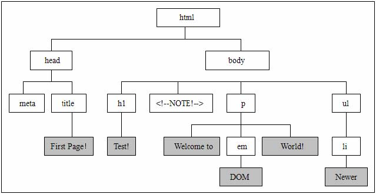

JavaScript DOM —— Node类型
=========

###1、DOM标准
DOM可以将任何HTML或XML文档描绘成一个由多层节点构成的结构。

节点分为几种不同类型，每种类型分别表示文档中不同信息和标记。

每个节点都拥有各自的特点、数据和方法，另外也与其他节点存在某种关系。

节点之间的关系构成了层次，而所有页面标记则表现为一个以特定节点为根节点的树形结构。




###2、属性和关系
**DOM1级**定义了一个Node接口，该接口将由DOM中的所有节点类型实现。这个Node接口在Javascript中是作为Node类型来实现的，**除了IE之外，在其他所有浏览器中都可以访问到这个类型**。Javascript所有节点类型都继承自Node类型，因此所有节点类型都 共享着相同的基本属性和方法。
####1）nodeType属性
**每个节点都有一个nodeType属性，用于表明节点的类型**。节点类型由在Node类型中定义的下列12个数值常量来表示，任何节点类型必居其一：
```javascript
Node.ELEMENT_NODE(1)
Node.ATTRIBUTE_NODE(2)
Node.TEXT_NODE(3)
Node.CDATA_SECTION_NODE(4)
Node.ENTITY_REFERENCE_NODE(5)
Node.ENTITY_NODE(6)
Node.PROCESSING_INSTRUCTION_NODE(7)
Node.COMMENT_NODE(8)
Node.DOCUMENT_NODE(9)
Node.DOCUMENT_TYPE_NODE(10)
Node.DOCUMENT_FRAGMENG_NODE(11)
Node.NOTATION_NODE(12)
```
通过比较上面这些常量，可以很容易的确定节点的类型。
```javascript
// 比较常量在IE中无效  
if (someNode.nodeType == Node.ELEMENT_NODE) {  
    alert("someNode is a element");  
}  
// 比较常量的值（括号中的数值）是通用的方法  
if (someNode.nodeType == 1) {  
    alert("someNode is a element");  
}  
```

####2）nodeName和nodeValue属性
这两个属性的值完全取决于节点的类型，在使用之前，最好检测一下节点类型。对于**元素节点，nodeName始终是元素的标签名，nodeValue始终为null**。
```javascript
// nodeName的值就是元素的标签名  
if (someNode.nodeType == 1) {  
    value = someNode.nodeName;  
}  
```

####3）childNodes属性
**每个节点都有一个childNodes属性**，其中保存着一个NodeList对象。NodeList是一种类数组对象，用于保存一组有序的节点，可以通过为止来访问这些节点。它有length属性，但不是Array的实例。NodeList对象基于DOM结构动态查询，可以实时反映DOM结构的变化。

**访问NodeList属性中节点的方法**：
```javascript
var firstchild = someNode.childNodes[0];  
var secondchild = someNode.childNodes.item(1);  
var count = someNode.childNodes.length;  
```

####4）parentNode属性
**每个节点都有一个parentNode属性**，指向文档树中的父节点。

####5）previousSibling属性和nextSibling属性
previousSibling属性表示childNodes列表中的元素的前一个兄弟元素，nextSibling则表示后一个兄弟元素。

####6）firstChild属性和lastChild属性
父节点的firstChild和lastChild属性分别指向其childNodes列表中的第一个和最后一个节点。
```javascript
// firstChild始终等于someNode.childNodes[0]  
alert(firstChild == someNode.childNodes[0]);  
// lastChild始终等于someNode.childNodes[someNode.childNodes.length-1]  
alert(lastChild == someNode.childNodes[someNode.childNodes.length-1]);  
```

####7）ownerDocument属性
**所有节点都有ownerDocument属性**，指向表示整个文档的文档节点，通过这个属性，我们可以不必在节点层次中通过层层回溯到达顶端，而是可以直接访问文档节点。

###3、操作方法
####1）hasChildNodes()
这个方法在节点包含一个或多个节点时返回true，应该说，这比查询childNodes列表中的length属性来确定节点是否存在子节点更简单。
```javascript
// 判断someNode节点是否存在子节点  
if (someNode.hasChildNodes()) {  
    alert("someNode has childNodes");  
}  

// 也可以通过length属性来判断  
if (someNode.childNodes.length > 0) {  
    alert("someNode has childNodes");  
}  
```

####2）appendChild()
该方法用于向childNodes列表的末尾添加一个节点，添加节点后，childNodes的新增节点、父节点及以前的最后一个子节点的关系指针都会更新，更新完成后appendChild（）返回新增的节点。
```javascript
var returnedNode = someNode.appendChild(newNode);  
// 返回的节点就是新增的节点  
alert(returnedNode == newNode);  
// 也是最后一个子元素节点  
alert(someNode.lastChild == newNode);  
```

如果传入到appendChild（）中的节点已经是文档的一部分了，结果就是将该节点从原来的位置转移到新的位置。任何DOM节点都不能同时出现在文档的多个位置。如果在调用appendChild（）时传入了父节点的第一个子节点，那么该节点就会成为父节点的最后一个子节点。
```javascript
// someNode有多个子节点  
var returnedNode = someNode.appendChild(someNode.firstChild);  
// 不再是第一个子元素节点  
alert(returnedNode == someNode.firstChild);  
// 而是最后一个子节点  
alert(returnedNode == someNode.lastChild);  
```

####3）insertBefore()
用于在childNodes列表中某个特定位置添加节点。

参数有两个：要插入的节点和作为参照的节点。插入节点后，被插入的节点会变成参照节点的前一个同胞节点（previousSibling），同时被方法返回，如果参照节点是null，操作结果与appendChild（）相同。
```javascript
// 插入后成为最后一个节点  
var returnedNode = someNode.insertBefore(newNode,null);  
alert(returnedNode == someNode.lastChild);  
```

####4）replaceChild()
替换节点。参数：要插入的节点和要替换的节点。返回值：被替换的节点。结果：被替换的节点从文档树中移除，节点位置被插入的节点占据。
```javascript
// 替换第一个子节点  
var returnedNode = someNode.replaceChild(newNode,someNode.firstChild);  
// 替换最后一个子节点  
var returnedNodet = someNode.replaceChild(newNode,someNode.lastChild);  
```
```html
<span style="font-size:18px;">
在使用replaceChild（）插入一个节点时，该节点的所有关系指针都会从被它替换的节点复制过来，
尽管从技术上讲，被替换的节点仍然还在文档中，但它在文档中已经没有了自己的位置。
</span>  
```

####5）removeChild()
如果只想移除而非替换节点，可以使用该方法。与replaceChild（）方法一样，removeChild（）方法移除的节点仍然为文档所有，只不过在文档中已经没有了自己的位置。
```javascript
// 移除第一个子节点  
var returned = someNode.removeChild(someNode.firstChild);  
// 移除最后一个子节点  
var returnedt = someNode.removeChild(someNode.lastChild);  
```

####6）cloneNode()
所有类型节点都支持。

用于创建调用这个方法的节点的一个完全相同的副本。
- 参数：布尔值，true表示执行深复制，也就是复制节点及其整个子节点树；false表示浅复制，只复制节点本身。
- 返回值：节点，为文档所有，但没有指定父节点，相当于创建了一个节点，需要通过其他方法将其放置在文档树的正确位置。

**【注】**
cloneNode（）方法不会复制添加到DOM节点中的javascript属性，例如事件处理程序等。

####7）normalize()
该方法的唯一作用就是处理文档树中的文本节点。

由于解析器的实现或DOM操作等原因，可能会出现文本节点不包含文本，或者接连出现两个文本节点的情况。当在某个节点上调用这个方法时，就会在该节点的后代节点中查找上述两种情况。如果找到了空文本节点，则删除它；如果找到相邻的文本节点，则将它们合并为一个文本节点。
